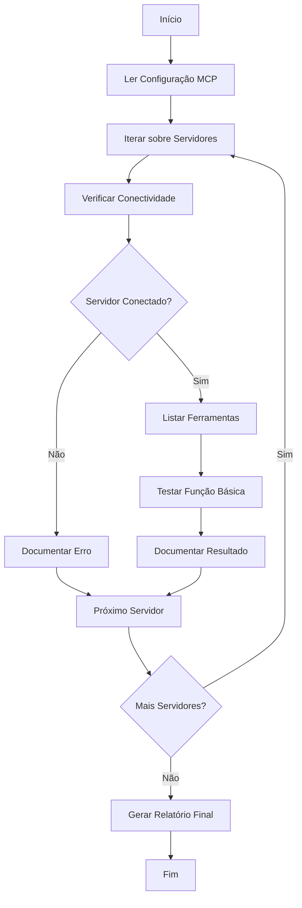

# Design Document - Teste de Servidores MCP

## Overview

Este documento descreve o design para testar e validar os servidores MCP (Model Context Protocol) configurados no ambiente Kiro. O objetivo é criar uma abordagem sistemática para testar cada servidor, documentar suas capacidades e identificar problemas de configuração.

## Arquitetura

O teste de servidores MCP será realizado através de uma série de chamadas HTTP para cada servidor configurado no arquivo `.kiro/settings/mcp.json`. A arquitetura do teste seguirá o seguinte fluxo:

1. Leitura da configuração dos servidores MCP
2. Para cada servidor:
   - Verificação de conectividade
   - Listagem de ferramentas disponíveis
   - Teste de uma função básica
   - Documentação dos resultados

## Componentes e Interfaces

### Componente de Leitura de Configuração
- **Função**: Ler e interpretar o arquivo de configuração MCP
- **Interface**: Acesso ao sistema de arquivos para ler `.kiro/settings/mcp.json`
- **Saída**: Lista estruturada de servidores MCP com suas configurações

### Componente de Teste de Conectividade
- **Função**: Verificar se cada servidor MCP está acessível
- **Interface**: Chamadas HTTP para os endpoints dos servidores
- **Saída**: Status de conectividade para cada servidor

### Componente de Descoberta de Ferramentas
- **Função**: Listar as ferramentas disponíveis em cada servidor MCP
- **Interface**: Chamadas para o endpoint de listagem de ferramentas
- **Saída**: Lista de ferramentas por servidor

### Componente de Teste de Função
- **Função**: Testar uma função básica em cada servidor
- **Interface**: Chamadas para executar funções específicas
- **Saída**: Resultado da execução da função

### Componente de Documentação
- **Função**: Documentar os resultados dos testes
- **Interface**: Geração de relatório estruturado
- **Saída**: Relatório detalhado sobre cada servidor MCP

## Modelos de Dados

### Modelo de Configuração de Servidor MCP
```json
{
  "serverName": {
    "type": "stdio|http",
    "command": "comando_execução",
    "args": ["arg1", "arg2"],
    "env": {
      "ENV_VAR1": "valor1"
    },
    "url": "url_do_servidor" // para servidores HTTP
  }
}
```

### Modelo de Resultado de Teste
```json
{
  "serverName": {
    "status": "connected|error",
    "error": "mensagem_de_erro",
    "tools": [
      {
        "name": "nome_da_ferramenta",
        "description": "descrição_da_ferramenta",
        "parameters": {}
      }
    ],
    "testResult": {
      "success": true|false,
      "response": {},
      "error": "mensagem_de_erro"
    }
  }
}
```

## Tratamento de Erros

1. **Erro de Configuração**: Se um servidor MCP tiver configuração inválida, o teste documentará o problema específico e sugerirá correções.
2. **Erro de Conectividade**: Se um servidor não estiver acessível, o teste registrará o erro de conexão e possíveis causas.
3. **Erro de Autenticação**: Se as credenciais estiverem incorretas, o teste identificará o problema de autenticação.
4. **Erro de Execução**: Se uma função falhar durante o teste, o erro será documentado com detalhes para diagnóstico.

## Estratégia de Teste

### Testes de Conectividade
- Verificar se o servidor está respondendo a requisições básicas
- Validar se o formato de resposta está correto

### Testes de Descoberta
- Listar todas as ferramentas disponíveis
- Verificar se as descrições e parâmetros estão presentes

### Testes de Função
- Executar uma função simples que não requer parâmetros complexos
- Verificar se a resposta está no formato esperado

### Testes de Configuração
- Validar se as variáveis de ambiente necessárias estão configuradas
- Verificar se os caminhos e URLs estão corretos

## Diagrama de Fluxo

