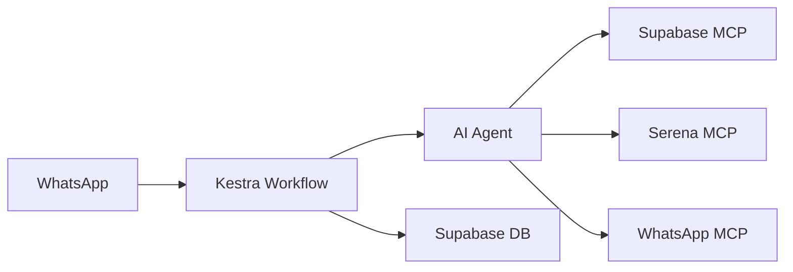

# Serena SDR - Agente Virtual de Pré-vendas 🤖

## 📋 Visão Geral

O **Serena SDR** é um agente virtual de pré-vendas (Sílvia) que automatiza conversas com leads via WhatsApp Business API. O sistema integra OCR de faturas de energia, qualificação de leads e apresentação de planos de energia solar.

## 🎯 Funcionalidades Principais

- ✅ **Conversa Automatizada** com leads via WhatsApp
- ✅ **OCR de Faturas** de energia usando OpenAI Vision
- ✅ **Qualificação de Leads** (conta ≥ R$ 200)
- ✅ **Apresentação de Planos** de energia solar (API Serena)
- ✅ **Follow-up Automático** em 2 horas se sem resposta
- ✅ **Integração MCP** com Supabase, Serena e WhatsApp

## 🏗️ Arquitetura



## 🔌 MCP Servers - Integração com APIs Externas

O agente SDR utiliza três servidores MCP (Model Context Protocol) para integração com APIs externas. **⚠️ IMPORTANTE**: Todos os MCPs conversam via JSON-RPC 2.0 no endpoint `/mcp`, não com múltiplos paths REST.

### 🎯 Padrão de Chamada JSON-RPC 2.0 (CRÍTICO)

**⚠️ TODAS as chamadas MCP seguem este formato exato:**

```json
POST {{MCP_URL}}/mcp
Content-Type: application/json

{
  "jsonrpc": "2.0",
  "id": 1,
  "method": "tools/call",
  "params": {
    "name": "<toolName>",
    "arguments": { /* ... */ }
  }
}
```

**Campos Obrigatórios:**
- `jsonrpc`: Sempre "2.0"
- `id`: Identificador único da requisição (número)
- `method`: Sempre "tools/call" para execução de ferramentas
- `params.name`: Nome exato da tool (ver tabelas abaixo)
- `params.arguments`: Objeto com parâmetros da tool

### 🔍 Health Check Consistente

**⚠️ IMPORTANTE**: Cada MCP server tem seu endpoint de health check:

| MCP Server | Health Check URL | Método | Resposta Esperada |
|------------|------------------|--------|-------------------|
| **WhatsApp** | `GET /health` | HTTP GET | `{"status": "healthy"}` |
| **Supabase** | `GET /health` | HTTP GET | `{"status": "healthy"}` |
| **Serena** | `GET /` | HTTP GET | `{"message": "Serena MCP Server is running!"}` |

**Exemplo de verificação:**
```bash
# WhatsApp MCP
curl http://bw48gc80kokwwckg0wskc40c.157.180.32.249.sslip.io/health

# Supabase MCP  
curl http://hwg4ks4ooooc04wsosookoog.157.180.32.249.sslip.io/health

# Serena MCP
curl http://mwc8k8wk0wg8o8s4k0w8scc4.157.180.32.249.sslip.io/
```

### 📋 Lista Completa de Tools & Assinaturas por MCP

#### **WhatsApp MCP Server**
| Tool | Parâmetros | Obrigatório | Exemplo de `arguments` |
|------|------------|-------------|------------------------|
| `sendTextMessage` | `to` (string), `message` (string) | ambos | `{"to": "5511999999999", "message": "Olá!"}` |
| `sendTemplateMessage` | `to`, `templateName`, `language`, `components[]` | todos | `{"to": "5511999999999", "templateName": "welcome", "language": "pt_BR", "components": []}` |
| `sendImageMessage` | `to`, `imageUrl`, `caption` | todos | `{"to": "5511999999999", "imageUrl": "https://example.com/img.jpg", "caption": "Confira!"}` |
| `markMessageAsRead` | `messageId` (string) | sim | `{"messageId": "wamid.ABC123..."}` |

#### **Supabase MCP Server**
| Tool | Parâmetros | Obrigatório | Exemplo de `arguments` |
|------|------------|-------------|------------------------|
| `execute_sql` | `query` (string), `params` (array) | `query` | `{"query": "SELECT * FROM leads WHERE phone = $1", "params": ["5511999999999"]}` |
| `list_tables` | — | — | `{}` |
| `apply_migration` | `name` (string), `query` (string) | ambos | `{"name": "create_table", "query": "CREATE TABLE..."}` |
| `get_logs` | `service` (string) | sim | `{"service": "api"}` |
| `get_advisors` | `type` (string) | sim | `{"type": "security"}` |
| `search_docs` | `graphql_query` (string) | sim | `{"graphql_query": "query { searchDocs..."}` |
| `list_edge_functions` | — | — | `{}` |
| `deploy_edge_function` | `name` (string), `files` (array) | ambos | `{"name": "func", "files": [{"name": "index.ts", "content": "..."}]}` |
| `list_storage_buckets` | — | — | `{}` |

#### **Serena MCP Server**
| Tool | Parâmetros | Obrigatório | Exemplo de `arguments` |
|------|------------|-------------|------------------------|
| `consultar_areas_operacao_gd` | `cidade`, `estado`, `codigo_ibge` | nenhum | `{"cidade": "São Paulo", "estado": "SP"}` |
| `obter_planos_gd` | `cidade`, `estado` ou `id_distribuidora` | cidade+estado OU id_distribuidora | `{"cidade": "Recife", "estado": "PE"}` |
| `validar_qualificacao_lead` | `cidade`, `estado`, `tipo_pessoa`, `valor_conta` | todos | `{"cidade": "Recife", "estado": "PE", "tipo_pessoa": "natural", "valor_conta": 800.00}` |
| `cadastrar_lead` | `dados_lead` (objeto completo) | sim | `{"dados_lead": {"fullName": "João", "personType": "natural", ...}}` |
| `buscar_lead_por_id` | `id_lead` (string) | sim | `{"id_lead": "lead_123456"}` |
| `atualizar_lead` | `id_lead`, `dados_atualizacao` | ambos | `{"id_lead": "lead_123", "dados_atualizacao": {"email": "novo@email.com"}}` |
| `atualizar_credenciais_distribuidora` | `id_lead`, `login`, `senha` | todos | `{"id_lead": "lead_123", "login": "user", "senha": "pass"}` |
| `criar_contrato` | `id_lead`, `plano` | ambos | `{"id_lead": "lead_123", "plano": {"id": 556, "name": "Premium"}}` |

### 🔧 Variáveis de Ambiente por MCP Server

#### **WhatsApp MCP Server**
```bash
WHATSAPP_API_TOKEN=your-whatsapp-api-token
WHATSAPP_PHONE_NUMBER_ID=599096403294262
WHATSAPP_BUSINESS_ACCOUNT_ID=your-business-account-id
WHATSAPP_API_VERSION=v23.0
PORT=45679
NODE_ENV=production
```

#### **Supabase MCP Server**
```bash
SUPABASE_ACCESS_TOKEN=sbp_your-supabase-pat
PROJECT_REF=your-project-reference
FEATURES=database,docs,functions,storage,debug,development
PORT=45678
```

#### **Serena MCP Server**
```bash
PARTNERSHIP_API_KEY=eyJhbGciOiJIUzI1NiIsInR5cCI6IkpXVCJ9...
PARTNERSHIP_API_ENDPOINT=https://partnership-service-staging.api.srna.co/
PORT=45677
```

### 🎯 Mapeamento Função Calling ⇄ Tool MCP

**⚠️ CRÍTICO**: No `ai_sdr_agent.py`, use nomes **idênticos** às tools listadas:

```python
functions = [
    {
        "name": "validar_qualificacao_lead",  # Serena MCP
        "description": "Valida se lead está qualificado para energia solar",
        "parameters": {
            "type": "object",
            "properties": {
                "cidade": {"type": "string"},
                "estado": {"type": "string"},
                "tipo_pessoa": {"type": "string"},
                "valor_conta": {"type": "number"}
            },
            "required": ["cidade", "estado", "tipo_pessoa", "valor_conta"]
        }
    },
    {
        "name": "sendTextMessage",           # WhatsApp MCP
        "description": "Envia mensagem de texto via WhatsApp",
        "parameters": {
            "type": "object",
            "properties": {
                "to": {"type": "string"},
                "message": {"type": "string"}
            },
            "required": ["to", "message"]
        }
    },
    {
        "name": "execute_sql",               # Supabase MCP
        "description": "Executa query SQL no Supabase",
        "parameters": {
            "type": "object",
            "properties": {
                "query": {"type": "string"}
            },
            "required": ["query"]
        }
    }
]
```

### 📊 Registro em lead_status e sdr_logs

**⚠️ OBRIGATÓRIO**: Após cada task crítica no workflow Kestra:

```yaml
# Após run_agent
- id: update_lead_status
  type: io.kestra.plugin.scripts.python.Script
  description: "Atualiza lead_status com resultado do agente"
  script: |
    import requests
    from kestra import Kestra
    
    # Dados do agente
    lead_id = "{{ trigger.body.lead_id }}"
    qualification_score = "{{ outputs.run_agent.vars.qualification_score }}"
    response_time_ms = "{{ outputs.run_agent.vars.response_time_ms }}"
    
    # Chamada Supabase MCP
    response = requests.post("{{ vars.SUPABASE_MCP_URL }}/mcp", json={
      "jsonrpc": "2.0",
      "id": 1,
      "method": "tools/call",
      "params": {
        "name": "execute_sql",
        "arguments": {
                "query": """
                INSERT INTO lead_status (lead_id, qualification_score, response_time_ms, timestamp)
                VALUES ($1, $2, $3, NOW())
                ON CONFLICT (lead_id) DO UPDATE SET
                    qualification_score = EXCLUDED.qualification_score,
                    response_time_ms = EXCLUDED.response_time_ms,
                    timestamp = NOW()
                """,
                "params": [lead_id, qualification_score, response_time_ms]
            }
        }
    })
    
    Kestra.outputs({"status_updated": True})

# Após cada task crítica
- id: log_sdr_step
  type: io.kestra.plugin.scripts.python.Script
  description: "Registra execução no sdr_logs"
  script: |
    import requests
    from kestra import Kestra
    
    task_name = "{{ task.id }}"
    lead_id = "{{ trigger.body.lead_id }}"
    success = "{{ outputs[task.id].vars.success }}" if "{{ outputs[task.id].vars.success }}" else True
    
    response = requests.post("{{ vars.SUPABASE_MCP_URL }}/mcp", json={
      "jsonrpc": "2.0",
      "id": 1,
      "method": "tools/call",
      "params": {
            "name": "execute_sql",
        "arguments": {
                "query": """
                INSERT INTO sdr_logs (lead_id, task_name, success, created_at)
                VALUES ($1, $2, $3, NOW())
                """,
                "params": [lead_id, task_name, success]
            }
        }
    })
    
    Kestra.outputs({"logged": True})
```

### ⚡ Políticas de Retry & Timeout

**⚠️ IMPLEMENTE em cada task Kestra:**

```yaml
# Para chamadas críticas (OpenAI, MCP)
  retries:
    maxAttempts: 3
    backoff:
      type: EXPONENTIAL
      delay: PT1S
timeout: PT15S

# Para WhatsApp (rate limiting)
retries:
  maxAttempts: 2
  backoff:
    type: LINEAR
    delay: PT5S
timeout: PT10S

# Para Supabase (banco de dados)
retries:
  maxAttempts: 3
  backoff:
    type: EXPONENTIAL
    delay: PT1S
timeout: PT15S
```

### 🔧 Configuração Cursor AI MCP Registration

**⚠️ PARA DESENVOLVIMENTO**: Adicione ao `~/.cursor/mcp.json`:

```json
{
  "mcpServers": {
    "supabase": {
      "command": "npx",
      "args": ["-y", "@modelcontextprotocol/server-supabase"],
      "env": {
        "SUPABASE_ACCESS_TOKEN": "sbp_your-supabase-pat",
        "PROJECT_REF": "your-project-reference",
        "FEATURES": "database,docs,functions,storage,debug,development"
      }
    },
    "serena": {
      "command": "python",
      "args": ["servidor_parcerias_mcp.py"],
      "env": {
        "PARTNERSHIP_API_KEY": "eyJhbGciOiJIUzI1NiIsInR5cCI6IkpXVCJ9...",
        "PARTNERSHIP_API_ENDPOINT": "https://partnership-service-staging.api.srna.co/"
      }
    },
    "whatsapp": {
      "command": "npx",
      "args": ["-y", "@mattcoatsworth/whatsapp-mcp-server"],
      "env": {
        "WHATSAPP_API_TOKEN": "your-whatsapp-api-token",
        "WHATSAPP_PHONE_NUMBER_ID": "599096403294262",
        "WHATSAPP_BUSINESS_ACCOUNT_ID": "your-business-account-id"
      }
    }
  }
}
```

### 🌐 Configuração de URLs no Ambiente

**⚠️ CRÍTICO**: As URLs dos MCP servers são configuradas via variáveis de ambiente:

```bash
# URLs dos MCP Servers (uniforme em UPPERCASE)
WHATSAPP_MCP_URL=http://bw48gc80kokwwckg0wskc40c.157.180.32.249.sslip.io/
SUPABASE_MCP_URL=http://hwg4ks4ooooc04wsosookoog.157.180.32.249.sslip.io/
SERENA_MCP_URL=http://mwc8k8wk0wg8o8s4k0w8scc4.157.180.32.249.sslip.io/

# Health Check URLs (uniforme em UPPERCASE)
WHATSAPP_MCP_HEALTH=http://bw48gc80kokwwckg0wskc40c.157.180.32.249.sslip.io/health
SUPABASE_MCP_HEALTH=http://hwg4ks4ooooc04wsosookoog.157.180.32.249.sslip.io/health
SERENA_MCP_HEALTH=http://mwc8k8wk0wg8o8s4k0w8scc4.157.180.32.249.sslip.io/
```

## 🛠️ Tech Stack

| Componente | Tecnologia |
|------------|------------|
| **Orquestração** | Kestra (self-hosted em Coolify) |
| **IA** | OpenAI GPT-4 (Function Calling) |
| **Banco de Dados** | Supabase (PostgreSQL) |
| **OCR** | OpenAI Vision (GPT-4) |
| **WhatsApp** | WhatsApp Business Cloud API |
| **MCP Servers** | Supabase, Serena, WhatsApp |
| **Monitoramento** | Logs Kestra + Métricas Supabase |

## 📁 Estrutura do Projeto

```
serena-sdr/
├── workflows/           # Workflows Kestra
│   ├── 1_lead_activation_flow.yml
│   └── 2_sdr_conversation_flow.yml
├── scripts/            # Código Python
│   ├── ai_sdr_agent.py
│   ├── follow_up_agent.py
│   ├── classify_media.py
│   ├── agent_tools/    # Ferramentas do agente
│   └── utils/          # Utilitários
├── config/             # Configurações
│   └── env/           # Variáveis de ambiente
├── docs/              # Documentação
├── tests/             # Testes
├── docker-compose.yml # Ambiente Docker
└── requirements.txt   # Dependências Python
```

## 🚀 Instalação e Configuração

### 1. Pré-requisitos

- Docker e Docker Compose
- Python 3.11+
- Acesso aos MCP Servers
- Kestra self-hosted em Coolify

### 2. Configuração do Ambiente

```bash
# Clone o repositório
git clone <repository-url>
cd serena-sdr

# Copie o arquivo de exemplo
cp config/env/env.example .env

# Edite as variáveis de ambiente
nano .env
```

### 3. Configuração das Variáveis de Ambiente

```bash
# OpenAI
OPENAI_API_KEY=sk-your-openai-api-key
OPENAI_MODEL=gpt-4o
OPENAI_MAX_TOKENS=1500

# MCP Servers
WHATSAPP_MCP_URL=http://bw48gc80kokwwckg0wskc40c.157.180.32.249.sslip.io/
SUPABASE_MCP_URL=http://hwg4ks4ooooc04wsosookoog.157.180.32.249.sslip.io/
SERENA_MCP_URL=http://mwc8k8wk0wg8o8s4k0w8scc4.157.180.32.249.sslip.io/

# Supabase
SUPABASE_URL=https://your-project.supabase.co
SUPABASE_ANON_KEY=your-supabase-anon-key
SUPABASE_SERVICE_ROLE_KEY=your-supabase-service-role-key

# Serena API
SERENA_API_TOKEN=your-serena-api-token

# WhatsApp
WHATSAPP_API_TOKEN=your-whatsapp-api-token
WHATSAPP_PHONE_NUMBER_ID=599096403294262

# Kestra
KESTRA_URL=https://kestra.darwinai.com.br/ui/
KESTRA_NAMESPACE=serena.production
```

### 4. Configuração dos MCP Servers para o Agente SDR

Os MCP servers são utilizados diretamente pelo agente SDR (`ai_sdr_agent.py`) através de HTTP requests. O agente faz chamadas JSON-RPC para os servidores MCP para executar suas funções.

**Configuração no Agente SDR:**
```python
# URLs dos MCP Servers configuradas no agente
SUPABASE_MCP_URL = "http://hwg4ks4ooooc04wsosookoog.157.180.32.249.sslip.io/"
SERENA_MCP_URL = "http://mwc8k8wk0wg8o8s4k0w8scc4.157.180.32.249.sslip.io/"
WHATSAPP_MCP_URL = "http://bw48gc80kokwwckg0wskc40c.157.180.32.249.sslip.io/"

# Exemplo de chamada MCP no agente
def call_mcp(self, name, args):
    if name == "execute_sql":
        url = f"{SUPABASE_MCP_URL}/mcp"
    elif name == "validar_qualificacao_lead":
        url = f"{SERENA_MCP_URL}/mcp"
    elif name == "sendTextMessage":
        url = f"{WHATSAPP_MCP_URL}/mcp"
    
    response = requests.post(url, json={
        "jsonrpc": "2.0",
        "id": 1,
        "method": "tools/call",
        "params": {
            "name": name,
            "arguments": args
        }
    })
    return response.json()
```

**⚠️ Importante**: 
- Os MCP servers são utilizados apenas pelo agente SDR, não pelo Cursor AI
- As URLs dos servidores MCP devem estar configuradas nas variáveis de ambiente do agente
- O agente SDR faz chamadas HTTP diretas para os servidores MCP

### 5. Iniciar os Serviços

```bash
# Iniciar todos os serviços
docker-compose up -d

# Verificar status
docker-compose ps

# Logs em tempo real
docker-compose logs -f
```

## 🔧 Desenvolvimento

### Blueprints de Referência

Antes de implementar, consulte os seguintes blueprints Kestra:

1. **"Chat with Elasticsearch Data"** - Busca semântica + chat via OpenAI
2. **"Use HuggingFace API para Classificar Mensagem"** - Classificação de conteúdo
   - **Link**: https://kestra.io/blueprints/use-huggingface-api-to-classify-message
   - **Uso**: Classificar se mensagem é imagem ou texto antes do OCR
   - **Output**: `is_image: boolean` para determinar se processar OCR
3. **"Wait & Remind"** - Pattern de follow-up automático
4. **OpenAI Cookbook "Deep Research API Agents"** - Multi-tool agent

### Estrutura do Workflow Kestra

#### 1. Lead Activation Flow (`1_lead_activation_flow.yml`)

```yaml
tasks:
  # ... outras tarefas ...
  
  - id: send-whatsapp-template
    type: io.kestra.plugin.scripts.python.Script
    # ... envio do template ...
    
  - id: update_initial_template_sent
    type: io.kestra.plugin.scripts.python.Script
    description: "Marca flag initial_template_sent = true após envio do template"
    runIf: "{{ outputs['send-whatsapp-template'].vars.template_sent == true }}"
    script: |
      import psycopg2
      import os
      from kestra import Kestra
      
      # Conectar ao Supabase
      conn = psycopg2.connect(os.getenv('SECRET_DB_CONNECTION_STRING'))
      cur = conn.cursor()
      
      # Atualizar flag
      cur.execute("""
        UPDATE leads 
        SET initial_template_sent = true, updated_at = NOW()
        WHERE phone_number = %s
      """, ("{{ trigger.body.whatsapp }}",))
      
      conn.commit()
      cur.close()
      conn.close()
      
      Kestra.outputs({"initial_template_sent": True})
```

#### 2. SDR Conversation Flow (`2_sdr_conversation_flow.yml`)

**⚠️ IMPORTANTE**: As métricas são alimentadas em momentos específicos:

- **`response_time_ms`**: Calculado no `run_agent` e registrado via `log_sdr_step`
- **`qualification_score`**: Definido após `validar_qualificacao_lead` via Serena MCP
- **`follow_up_sent`**: Marcado após `follow_up_if_needed` ser executado
- **`contract_created`**: Definido após `criar_contrato` via Serena MCP

```yaml
triggers:
  - id: whatsapp_sdr_trigger
    type: io.kestra.plugin.core.trigger.Webhook
    key: converse_sdr_silvia

tasks:
  - id: log_inicial
    type: io.kestra.plugin.core.log.Log
    
  - id: extract_media_id
    type: io.kestra.plugin.scripts.python.Script
    
  - id: classify_media
    type: io.kestra.plugin.scripts.python.Script
    description: "Classifica se é imagem ou texto usando HuggingFace API"
    script: "{{ read('scripts/classify_media.py') }}"
    # Executa logo após extract_media_id e antes de run_agent
    # Output: Kestra.outputs({'is_image': bool})
    
  - id: get_lead_data
    type: io.kestra.plugin.core.http.Request
    uri: "{{ vars.SUPABASE_MCP_URL }}/mcp"
    method: POST
    headers:
      Content-Type: "application/json"
    body: |
      {
        "jsonrpc": "2.0",
        "id": 1,
        "method": "tools/call",
        "params": {
          "name": "execute_sql",
          "arguments": {
            "query": "SELECT * FROM leads WHERE phone_number = $1",
            "params": ["{{ trigger.body.phone }}"]
          }
        }
      }
    retries:
      maxAttempts: 3
      backoff:
        type: EXPONENTIAL
        delay: PT1S
    allowFailure: true
    
  - id: run_agent
    type: io.kestra.plugin.scripts.python.Script
    script: "{{ read('scripts/ai_sdr_agent.py') }}"
    env:
      LEAD_DATA: "{{ outputs.get_lead_data.body }}"
      MEDIA_ID: "{{ outputs.extract_media_id.vars.media_id }}"
      IS_IMAGE: "{{ outputs.classify_media.vars.is_image }}"
    
  - id: send_whatsapp
    type: io.kestra.plugin.core.http.Request
    uri: "{{ vars.WHATSAPP_MCP_URL }}/mcp"
    method: POST
    headers:
      Content-Type: "application/json"
    body: |
      {
        "jsonrpc": "2.0",
        "id": 1,
        "method": "tools/call",
        "params": {
          "name": "sendTextMessage",
          "arguments": {
            "to": "{{ trigger.body.phone }}",
            "message": "{{ outputs.run_agent.vars.response }}"
          }
        }
      }
    retries:
      maxAttempts: 2
      backoff:
        type: LINEAR
        delay: PT5S
    allowFailure: true
    
  - id: wait_2h
    type: io.kestra.plugin.core.conds.Wait
    duration: PT2H
    
  - id: check_response
    type: io.kestra.plugin.core.http.Request
    uri: "{{ vars.WHATSAPP_MCP_URL }}/mcp"
    method: POST
    headers:
      Content-Type: "application/json"
    body: |
      {
        "jsonrpc": "2.0",
        "id": 1,
        "method": "tools/call",
        "params": {
          "name": "list_messages",
          "arguments": {
            "phone": "{{ trigger.body.phone }}"
          }
        }
      }
    
  - id: follow_up_if_needed
    type: io.kestra.plugin.scripts.python.Script
    script: "{{ read('scripts/follow_up_agent.py') }}"
    runIf: "{{ outputs.check_response.body.messages | length == 0 }}"
    # Se messages.length > 0, o lembrete é automaticamente ignorado

errors:
  - id: global_error_handler
    type: io.kestra.plugin.core.log.Log
    level: ERROR
    
  - id: send_fallback_message
    type: io.kestra.plugin.core.http.Request
    uri: "{{ vars.WHATSAPP_MCP_URL }}/mcp"
    method: POST
    headers:
      Content-Type: "application/json"
    runIf: "{{ _error != null }}"
    body: |
      {
        "jsonrpc": "2.0",
        "id": 1,
        "method": "tools/call",
        "params": {
          "name": "sendTextMessage",
          "arguments": {
        "to": "{{ trigger.body.phone }}",
            "message": "Desculpe, tivemos um problema técnico. Retornarei em breve. 😊"
          }
        }
      }
```

### Lógica de Primeiro Contato

O agente verifica automaticamente se é a primeira interação:

1. **Task Kestra `get_lead_data`**: HTTP Request ao Supabase MCP retorna dados do lead incluindo `initial_template_sent`
2. **Função OpenAI `get_lead_data`**: Invocada pelo agente para buscar dados adicionais
3. **Decisão de Saudação**: 
   - Se `initial_template_sent = true` → Vai direto para qualificação
   - Se `initial_template_sent = false` → Envia saudação inicial
4. **Sem KV Store**: Toda lógica baseada no banco de dados Supabase

### Agente Conversacional

O `ai_sdr_agent.py` implementa OpenAI Function Calling com as seguintes funções:

```python
functions = [
    {
        "name": "get_lead_data",
        "description": "Retorna dados do lead pelo ID",
        "parameters": {
            "type": "object",
            "properties": {
                "lead_id": {"type": "string"}
            },
            "required": ["lead_id"]
        }
    },
    {
        "name": "get_energy_plans",
        "description": "Lista planos de GD para cidade/estado",
        "parameters": {
            "type": "object",
            "properties": {
                "city": {"type": "string"},
                "state": {"type": "string"}
            },
            "required": ["city", "state"]
        }
    },
    {
        "name": "process_energy_bill_image",
        "description": "OCR de imagem de fatura retorna JSON",
        "parameters": {
            "type": "object",
            "properties": {
                "image_url": {"type": "string"}
            },
            "required": ["image_url"]
        }
    },
    {
        "name": "send_whatsapp_message",
        "description": "Envia mensagem via WhatsApp MCP",
        "parameters": {
            "type": "object",
            "properties": {
                "to": {"type": "string"},
                "text": {"type": "string"}
            },
            "required": ["to", "text"]
        }
    },
    {
        "name": "create_contract",
        "description": "Cria contrato na API Serena",
        "parameters": {
            "type": "object",
            "properties": {
                "lead_id": {"type": "string"},
                "plan_id": {"type": "string"}
            },
            "required": ["lead_id", "plan_id"]
        }
    }
]
```

### Follow-up Automático

O `follow_up_agent.py` implementa o pattern "Wait & Remind":

```python
class FollowUpAgent:
    def generate_follow_up(self, lead_id, phone_number, lead_data):
        # Gera lembrete personalizado usando OpenAI
        # Chama WhatsApp MCP para enviar
        # Registra no lead_status
        pass
```

**Scripts Auxiliares**:

#### `classify_media.py`
**Função**: Classifica o tipo de mídia recebida (imagem vs texto)
**Input**:
- `message_type` (string): Tipo da mensagem ("text", "image", "document")
- `media_id` (string, opcional): ID da mídia se disponível
- `message_text` (string, opcional): Texto da mensagem

**Output**:
```json
{
  "media_type": "image|text|document",
  "is_energy_bill": true|false,
  "confidence": 0.95,
  "extracted_text": "string (se aplicável)",
  "processing_required": true|false
}
```

#### `follow_up_agent.py`
**Função**: Gera mensagem de follow-up quando não há resposta em 2h
**Input**:
- `lead_id` (string): ID do lead
- `last_message` (string): Última mensagem enviada
- `conversation_context` (object): Contexto da conversa
- `follow_up_type` (string): Tipo de follow-up ("reminder", "offer", "closing")

**Output**:
```json
{
  "follow_up_message": "string",
  "follow_up_type": "reminder|offer|closing",
  "should_continue": true|false,
  "next_action": "wait|close|escalate"
}
```

#### `extract_media_id.py`
**Função**: Extrai media_id do payload do webhook WhatsApp
**Input**:
- `webhook_payload` (object): Payload completo do webhook

**Output**:
```json
{
  "media_id": "string|null",
  "message_type": "text|image|document",
  "extraction_success": true|false
}
```

## 📊 Persistência e Métricas

### Tabelas Supabase

```sql
-- Tabela principal de leads
CREATE TABLE leads (
    id SERIAL PRIMARY KEY,
    phone_number VARCHAR UNIQUE NOT NULL,
    name VARCHAR NOT NULL,
    invoice_amount DECIMAL(10,2),
    client_type VARCHAR,
    city VARCHAR,
    state VARCHAR,
    additional_data JSONB,
    initial_template_sent BOOLEAN DEFAULT FALSE,
    created_at TIMESTAMP DEFAULT NOW(),
    updated_at TIMESTAMP DEFAULT NOW()
);

-- Tabela de status e métricas do SDR
CREATE TABLE lead_status (
    lead_id VARCHAR PRIMARY KEY,
    status VARCHAR NOT NULL,
    timestamp TIMESTAMP DEFAULT NOW(),
    notes TEXT,
    bill_amount DECIMAL(10,2),
    qualification_score INTEGER,
    response_time_ms INTEGER,
    follow_up_sent BOOLEAN DEFAULT FALSE,
    contract_created BOOLEAN DEFAULT FALSE
);

-- Tabela de logs para métricas
CREATE TABLE sdr_logs (
    id SERIAL PRIMARY KEY,
    lead_id VARCHAR,
    task_name VARCHAR,
    start_time TIMESTAMP,
    end_time TIMESTAMP,
    duration_ms INTEGER,
    success BOOLEAN,
    error_message TEXT,
    created_at TIMESTAMP DEFAULT NOW()
);
```

### Métricas Alvo

```sql
-- Tempo médio de resposta IA
SELECT AVG(response_time_ms) / 1000.0 as avg_response_time_seconds
FROM lead_status 
WHERE response_time_ms IS NOT NULL;

-- Taxa de leads qualificados
SELECT 
    COUNT(*) FILTER (WHERE qualification_score >= 1) * 100.0 / COUNT(*) as qualification_rate
FROM lead_status;

-- TTL de follow-up
SELECT AVG(EXTRACT(EPOCH FROM (timestamp - created_at))) / 3600 as avg_followup_hours
FROM lead_status 
WHERE follow_up_sent = true;

-- Taxa de conversão para contrato
SELECT 
    COUNT(*) FILTER (WHERE contract_created = true) * 100.0 / COUNT(*) as conversion_rate
FROM lead_status;
```

### Dashboard Supabase

Configure visualizações no Supabase Dashboard:

1. **Métricas Gerais**: Taxa de qualificação, tempo de resposta
2. **Performance**: Gráfico de tempo de resposta por período
3. **Conversões**: Funnel de leads → qualificados → contratos
4. **Erros**: Logs de falhas e retry attempts

### Políticas de Retry & Fallback

#### Retry Policies para Chamadas Críticas:

**OpenAI API Calls:**
- **Máximo de tentativas**: 3
- **Backoff exponencial**: 1s, 2s, 4s
- **Timeout**: 30 segundos por tentativa
- **Fallback**: Mensagem genérica se todas as tentativas falharem

**MCP Server Calls:**
- **Máximo de tentativas**: 3
- **Backoff exponencial**: 1s, 2s, 4s
- **Timeout**: 15 segundos por tentativa
- **Fallback**: Log de erro e continuação do workflow

**WhatsApp API Calls:**
- **Máximo de tentativas**: 2
- **Backoff linear**: 5s, 10s
- **Timeout**: 10 segundos por tentativa
- **Fallback**: Mensagem de erro técnica para o lead

#### Implementação no Agente SDR:

```python
def call_mcp_with_retry(self, name, args, max_retries=3, base_delay=1):
    """Chama MCP server com retry exponencial"""
    for attempt in range(max_retries):
        try:
            response = self.call_mcp(name, args)
            if response.get('success', True):
                return response
        except Exception as e:
            if attempt == max_retries - 1:
                raise e
            delay = base_delay * (2 ** attempt)
            time.sleep(delay)
    return None
```

#### Fallback Messages:

**Erro no Agente IA:**
```
"Olá! Sou a Sílvia da Serena Energia. 😊 No momento estou com dificuldades técnicas. Por favor, tente novamente em alguns minutos ou entre em contato conosco pelo nosso canal oficial. Obrigada pela compreensão!"
```

**Erro no Envio WhatsApp:**
```
"Desculpe, tivemos um problema técnico. Retornarei em breve. 😊"
```

### Logging de Etapas Críticas

Após cada etapa crítica, o workflow registra no `sdr_logs` e `lead_status`. **⚠️ IMPORTANTE**: O script `log_sdr_step` pré-configura `vars.response_time_ms` via saída do agente.

#### Registro em `sdr_logs`:
```yaml
- id: log_sdr_step
  type: io.kestra.plugin.scripts.python.Script
  description: "Registra execução da etapa no sdr_logs"
  script: |
    import os
    import time
    from kestra import Kestra
    
    # Dados da execução
    task_name = "{{ task.id }}"
    lead_id = "{{ trigger.body.lead_id }}"
    start_time = "{{ execution.startDate }}"
    end_time = time.time()
    duration_ms = int((end_time - start_time) * 1000)
    success = "{{ outputs[task.id].vars.success }}" if "{{ outputs[task.id].vars.success }}" else True
    
    # Log para Supabase MCP
    log_data = {
        "lead_id": lead_id,
        "task_name": task_name,
        "start_time": start_time,
        "end_time": end_time,
        "duration_ms": duration_ms,
        "success": success,
        "error_message": "{{ _error }}" if "{{ _error }}" else None
    }
    
    # Chamada para Supabase MCP
    import requests
    requests.post("{{ vars.SUPABASE_MCP_URL }}/mcp", json={
        "jsonrpc": "2.0",
        "id": 1,
        "method": "tools/call",
        "params": {
            "name": "execute_sql",
            "arguments": {
                "query": """
                INSERT INTO sdr_logs (lead_id, task_name, start_time, end_time, duration_ms, success, error_message)
                VALUES (%s, %s, %s, %s, %s, %s, %s)
                """,
                "params": [lead_id, task_name, start_time, end_time, duration_ms, success, log_data["error_message"]]
            }
        }
    })
    
    Kestra.outputs({"logged": True})
```

#### Registro em `lead_status`:
```yaml
- id: update_lead_status
  type: io.kestra.plugin.scripts.python.Script
  description: "Atualiza status do lead no lead_status"
  script: |
    import os
    from kestra import Kestra
    
    lead_id = "{{ trigger.body.lead_id }}"
    status = "{{ vars.status }}"  # "processing", "qualified", "contract_created", "error"
    notes = "{{ vars.notes }}" if "{{ vars.notes }}" else None
    bill_amount = "{{ vars.bill_amount }}" if "{{ vars.bill_amount }}" else None
    qualification_score = "{{ vars.qualification_score }}" if "{{ vars.qualification_score }}" else None
    response_time_ms = "{{ vars.response_time_ms }}" if "{{ vars.response_time_ms }}" else None
    
    # Chamada para Supabase MCP
    import requests
    requests.post("{{ vars.SUPABASE_MCP_URL }}/mcp", json={
        "jsonrpc": "2.0",
        "id": 1,
        "method": "tools/call",
        "params": {
            "name": "execute_sql",
            "arguments": {
                "query": """
                INSERT INTO lead_status (lead_id, status, notes, bill_amount, qualification_score, response_time_ms)
                VALUES (%s, %s, %s, %s, %s, %s)
                ON CONFLICT (lead_id) DO UPDATE SET
                    status = EXCLUDED.status,
                    notes = EXCLUDED.notes,
                    bill_amount = EXCLUDED.bill_amount,
                    qualification_score = EXCLUDED.qualification_score,
                    response_time_ms = EXCLUDED.response_time_ms,
                    timestamp = NOW()
                """,
                "params": [lead_id, status, notes, bill_amount, qualification_score, response_time_ms]
            }
        }
    })
    
    Kestra.outputs({"status_updated": True})
```

**⚠️ POSICIONAMENTO**: Esta task deve ser executada logo após `run_agent` ou `follow_up_if_needed` para registrar o status atualizado.

## 🐳 Docker Compose

```yaml
version: '3.8'
services:
  # MCP Supabase Server
  supabase-mcp:
    image: node:18-alpine
    container_name: serena-sdr-supabase-mcp
    working_dir: /app
    command: >
      sh -c "npm install -g @modelcontextprotocol/server-supabase &&
             mcp-server-supabase"
    environment:
      - SUPABASE_URL=${SUPABASE_URL}
      - SUPABASE_ANON_KEY=${SUPABASE_ANON_KEY}
    ports:
      - "3001:3001"
    networks:
      - serena-sdr-network
    restart: unless-stopped

  # MCP Serena Server
  serena-mcp:
    image: node:18-alpine
    container_name: serena-sdr-serena-mcp
    working_dir: /app
    command: >
      sh -c "npm install -g @serena/mcp-server &&
             serena-mcp-server"
    environment:
      - SERENA_API_TOKEN=${SERENA_API_TOKEN}
    ports:
      - "3002:3002"
    networks:
      - serena-sdr-network
    restart: unless-stopped

  # MCP WhatsApp Server
  whatsapp-mcp:
    image: node:18-alpine
    container_name: serena-sdr-whatsapp-mcp
    working_dir: /app
    command: >
      sh -c "npm install -g @mattcoatsworth/whatsapp-mcp-server &&
             whatsapp-mcp-server"
    environment:
      - WHATSAPP_API_TOKEN=${WHATSAPP_API_TOKEN}
      - WHATSAPP_PHONE_NUMBER_ID=${WHATSAPP_PHONE_NUMBER_ID}
    ports:
      - "3003:3003"
    networks:
      - serena-sdr-network
    restart: unless-stopped

  # Kestra Agent
  kestra-agent:
    build:
      context: .
      dockerfile: Dockerfile.agent
    container_name: serena-sdr-kestra-agent
    environment:
      - OPENAI_API_KEY=${OPENAI_API_KEY}
      - SUPABASE_MCP_URL=http://supabase-mcp:3001
      - SERENA_MCP_URL=http://serena-mcp:3002
      - WHATSAPP_MCP_URL=http://whatsapp-mcp:3003
    volumes:
      - ./scripts:/app/scripts
      - ./config:/app/config
    networks:
      - serena-sdr-network
    restart: unless-stopped
    depends_on:
      - supabase-mcp
      - serena-mcp
      - whatsapp-mcp

networks:
  serena-sdr-network:
    driver: bridge
    name: serena-sdr-network
```

## 🧪 Testes

### Testes Unitários

```bash
# Instalar dependências de teste
pip install -r requirements.txt

# Executar testes unitários
pytest tests/unit/

# Executar testes de integração
pytest tests/integration/
```

### Teste E2E

```bash
# Teste completo do fluxo WhatsApp
python -m pytest tests/e2e/test_whatsapp_flow.py

# Simulação Kestra
kestra test workflows/2_sdr_conversation_flow.yml
```

### Teste dos MCP Servers

```bash
# Testar WhatsApp MCP Server
curl -X POST http://bw48gc80kokwwckg0wskc40c.157.180.32.249.sslip.io/mcp \
  -H "Content-Type: application/json" \
  -d '{"jsonrpc": "2.0", "id": 1, "method": "tools/list"}'

# Testar Supabase MCP Server
curl -X POST http://hwg4ks4ooooc04wsosookoog.157.180.32.249.sslip.io/mcp \
  -H "Content-Type: application/json" \
  -d '{"jsonrpc": "2.0", "id": 1, "method": "tools/list"}'

# Testar Serena MCP Server
curl -X POST http://mwc8k8wk0wg8o8s4k0w8scc4.157.180.32.249.sslip.io/mcp \
  -H "Content-Type: application/json" \
  -d '{"jsonrpc": "2.0", "id": 1, "method": "tools/list"}'

# Testar validação de qualificação
curl -X POST http://mwc8k8wk0wg8o8s4k0w8scc4.157.180.32.249.sslip.io/mcp \
  -H "Content-Type: application/json" \
  -d '{
    "jsonrpc": "2.0",
    "id": 1,
    "method": "tools/call",
    "params": {
      "name": "validar_qualificacao_lead",
      "arguments": {
        "cidade": "Recife",
        "estado": "PE",
        "tipo_pessoa": "natural",
        "valor_conta": 800.00
      }
    }
  }'

# Testar envio de mensagem WhatsApp
curl -X POST http://bw48gc80kokwwckg0wskc40c.157.180.32.249.sslip.io/mcp \
  -H "Content-Type: application/json" \
  -d '{
    "jsonrpc": "2.0",
    "id": 1,
    "method": "tools/call",
    "params": {
      "name": "sendTextMessage",
      "arguments": {
        "to": "5511999999999",
        "message": "Teste do MCP Server"
      }
    }
  }'

# Testar consulta SQL no Supabase
curl -X POST http://hwg4ks4ooooc04wsosookoog.157.180.32.249.sslip.io/mcp \
  -H "Content-Type: application/json" \
  -d '{
    "jsonrpc": "2.0",
    "id": 1,
    "method": "tools/call",
    "params": {
      "name": "execute_sql",
      "arguments": {
        "query": "SELECT COUNT(*) FROM leads"
      }
    }
  }'
```

### Estrutura de Testes

```
tests/
├── unit/
│   ├── test_ai_sdr_agent.py
│   ├── test_follow_up_agent.py
│   ├── test_classify_media.py
│   ├── test_supabase_tools.py
│   └── test_serena_tools.py
├── integration/
│   ├── test_mcp_integration.py
│   └── test_workflow_steps.py
└── e2e/
    ├── test_whatsapp_flow.py
    └── test_lead_qualification.py
```

## 📈 Deploy

### Produção (Coolify)

1. Configure o repositório no Coolify
2. Configure as variáveis de ambiente
3. Deploy automático via Git
4. Ative o trigger webhook no Kestra

### Desenvolvimento

```bash
# Build da imagem
docker build -f Dockerfile.agent -t serena-sdr-agent .

# Executar localmente
docker run -d --name serena-sdr-agent \
  --env-file .env \
  --network serena-sdr-network \
  serena-sdr-agent
```

## 🔍 Troubleshooting

### Problemas Comuns

1. **MCP Server não responde**
   - Verificar se os servidores MCP estão online:
     - WhatsApp: `curl http://bw48gc80kokwwckg0wskc40c.157.180.32.249.sslip.io/health`
     - Supabase: `curl http://hwg4ks4ooooc04wsosookoog.157.180.32.249.sslip.io/health`
     - Serena: `curl http://mwc8k8wk0wg8o8s4k0w8scc4.157.180.32.249.sslip.io/`
   - Verificar URLs corretas nas variáveis de ambiente
   - Verificar logs dos servidores MCP

2. **Erro de autenticação OpenAI**
   - Verificar `OPENAI_API_KEY` no `.env`
   - Verificar limites de uso da API

3. **WhatsApp não envia mensagens**
   - Verificar `WHATSAPP_API_TOKEN`
   - Verificar `WHATSAPP_PHONE_NUMBER_ID`
   - Testar endpoint: `curl -X POST http://bw48gc80kokwwckg0wskc40c.157.180.32.249.sslip.io/mcp -H "Content-Type: application/json" -d '{"jsonrpc": "2.0", "id": 1, "method": "tools/list"}'`

4. **Workflow Kestra falha**
   - Verificar logs no Kestra UI
   - Verificar variáveis de ambiente
   - Verificar conectividade com MCP servers

5. **Flag initial_template_sent não atualiza**
   - Verificar conexão com Supabase
   - Verificar permissões da tabela leads
   - Verificar se `send-whatsapp-template` foi executado com sucesso

6. **Erro de qualificação de lead**
   - Verificar se conta de energia ≥ R$ 200
   - Verificar se região está coberta pela GD
   - Testar validação: `curl -X POST http://mwc8k8wk0wg8o8s4k0w8scc4.157.180.32.249.sslip.io/mcp -H "Content-Type: application/json" -d '{"jsonrpc": "2.0", "id": 1, "method": "tools/call", "params": {"name": "validar_qualificacao_lead", "arguments": {"cidade": "Recife", "estado": "PE", "tipo_pessoa": "natural", "valor_conta": 800.00}}}'`

7. **Erro de duplicidade no cadastro**
   - Verificar se email/telefone já existe na base
   - Usar dados únicos para testes
   - Verificar logs de erro da API Serena

### Logs

```bash
# Logs do agente
docker-compose logs -f kestra-agent

# Logs do Kestra
docker-compose logs -f kestra

# Logs de todos os serviços
docker-compose logs -f
```

## 📚 Documentação Adicional

- [Kestra Documentation](https://kestra.io/docs)
- [OpenAI Function Calling](https://platform.openai.com/docs/guides/function-calling)
- [WhatsApp Business API](https://developers.facebook.com/docs/whatsapp/cloud-api)
- [Supabase Documentation](https://supabase.com/docs)

### 📖 Documentação dos MCP Servers

- **[WhatsApp MCP Server](README-whatsapp-mcp-server.md)** - Servidor para envio de mensagens WhatsApp
- **[Supabase MCP Server](README-supabase-mcp-server.md)** - Servidor para acesso ao banco de dados
- **[Serena MCP Server](README-serena-mcp-server.md)** - Servidor para integração com API de Parcerias Serena

### 🔗 URLs dos Servidores MCP

| Servidor | URL | Status | Health Check |
|----------|-----|--------|--------------|
| **WhatsApp MCP** | `http://bw48gc80kokwwckg0wskc40c.157.180.32.249.sslip.io/` | ✅ Operacional | `GET /health` |
| **Supabase MCP** | `http://hwg4ks4ooooc04wsosookoog.157.180.32.249.sslip.io/` | ✅ Operacional | `GET /health` |
| **Serena MCP** | `http://mwc8k8wk0wg8o8s4k0w8scc4.157.180.32.249.sslip.io/` | ✅ Operacional | `GET /health` |

### **Endpoints MCP por Servidor:**

- **WhatsApp MCP**: `POST /mcp` (JSON-RPC 2.0)
- **Supabase MCP**: `POST /mcp` (JSON-RPC 2.0)  
- **Serena MCP**: `GET /tools` (REST API) + `POST /tools/{tool_name}`

### **Ferramentas Disponíveis:**

**WhatsApp MCP (4 tools):**
- `sendTextMessage` - Envio de mensagens de texto
- `sendTemplateMessage` - Envio de templates aprovados
- `sendImageMessage` - Envio de imagens com legenda
- `markMessageAsRead` - Marcar mensagem como lida

**Supabase MCP (16 tools):**
- `list_tables`, `execute_sql`, `apply_migration`
- `get_logs`, `get_advisors`, `search_docs`
- `list_edge_functions`, `deploy_edge_function`
- `list_storage_buckets` e mais...

**Serena MCP (9 tools):**
- `consultar_areas_operacao_gd` - Consultar áreas de operação
- `obter_planos_gd` - Obter planos de GD
- `cadastrar_lead`, `buscar_leads`, `validar_qualificacao_lead`
- `buscar_lead_por_id`, `atualizar_lead`
- `atualizar_credenciais_distribuidora`, `criar_contrato`

## 🤝 Contribuição

1. Fork o projeto
2. Crie uma branch para sua feature
3. Commit suas mudanças
4. Push para a branch
5. Abra um Pull Request

## 📄 Licença

Este projeto é proprietário da Serena Energia.

---

**Desenvolvido com ❤️ pela equipe Serena SDR** 