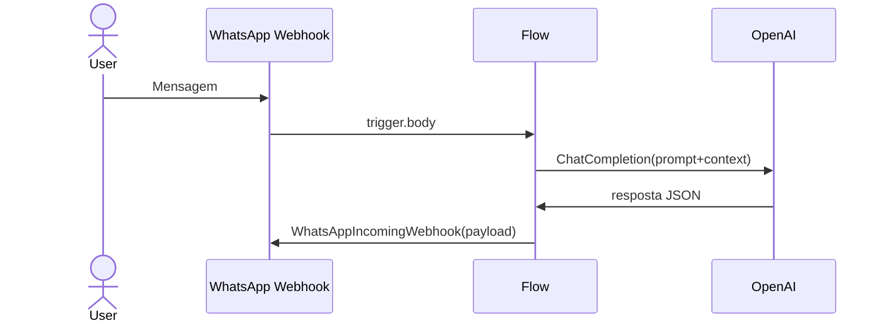

# Guia Prático de Agentes de IA com Kestra Self-Hosted, Coolify/Docker e WhatsApp Business Cloud API

Este guia detalha, passo a passo, como criar, versionar e operar projetos de Inteligência Artificial que conversam com humanos via WhatsApp, usando Kestra open source em ambiente self-hosted no Coolify. Ele combina conceitos de orquestração, boas práticas de DevOps e exemplos completos de fluxos para agentes conversacionais, integrando plugins OpenAI, LangChain4j, WhatsApp e OCR de documentos.

## Visão Geral

Implantar Kestra self-hosted no Coolify permite escalar workflows declarativos, manter controle total sobre dados sensíveis e integrar rapidamente APIs externas, como WhatsApp Business Cloud, OpenAI e Supabase[1][2]. A combinação oferece:

- Execução de workflows event-driven em YAML que acionam APIs, scripts Python, Java ou qualquer linguagem[3][4].
- Biblioteca de plugins (750+) para IA generativa, NLP, notificações e armazenamento[5][6].
- Desdobramento contínuo via GitHub Actions ou Terraform para atualizar flows sem downtime[1][7].
- Observabilidade em tempo real com logs e replays para flocos longos ou conversa contínua[8][1].

## Estrutura do Documento

- Instalação self-host no Coolify
- Fundamentos do WhatsApp Business Cloud API
- Plugins Kestra para WhatsApp
- Plugins Kestra para IA ( OpenAI & LangChain4j)
- Padrões de Design para Agentes Conversacionais
- Exemplo Completo: Qualificação de Leads (workflow anexo)
- Monitoramento, Observabilidade e Testes
- CI/CD e GitOps para Flows e Namespace Files
- Melhores Práticas de Segurança e Escalabilidade

## Instalação Self-Hosted no Coolify

### Requisitos de Infraestrutura

| Componente | Configuração mínima | Observações |
|------------|--------------------|-------------|
| VPS | 2 vCPU, 4 GB RAM, 30 GB SSD[9] | Pode escalar horizontalmente com Coolify[1] |
| Docker Engine | 24.0+ | Necessário para executar containers Kestra[2] |
| Coolify | Última versão `v4` | Instalado via script *one-liner*[10] |

### Passo a Passo

1. **Instalar Coolify na VPS**  
```bash
curl -fsSL https://get.coollabs.io/coolify/install.sh | bash
```
2. **Criar Projeto Kestra**  
   - No painel Coolify → *New Project* → *Docker Compose*.
   - Usar o `docker-compose.yml` oficial como ponto de partida[2].

3. **Docker Compose Persistente**  
```yaml
version: "3.9"
services:
  postgres:
    image: postgres:15
    environment:
      POSTGRES_DB: kestra
      POSTGRES_USER: kestra
      POSTGRES_PASSWORD: k3str4
    volumes:
      - pgdata:/var/lib/postgresql/data
  kestra:
    image: kestra/kestra:latest
    ports:
      - "8080:8080"
    environment:
      KESTRA_CONFIGURATION_PATH: /etc/config/application.yaml
    volumes:
      - ./application.yaml:/etc/config/application.yaml
      - /var/run/docker.sock:/var/run/docker.sock
      - kestra-storage:/app/storage
volumes:
  pgdata:
  kestra-storage:
```
4. **Domain & HTTPS**  
   - Em *Environment Variables* do Coolify, definir `KESTRA_URL` com domínio público para links na UI[1].
   - Coolify provisiona TLS via Caddy automaticamente[9].

5. **Deploy** pelo botão *Deploy* e aguarde containers `postgres` e `kestra` ficarem verdes[1].

## Fundamentos do WhatsApp Business Cloud API

O WhatsApp Business Cloud API fornece endpoints REST hospedados pelo Meta, cobrados por janela de 24 h de conversa[11]. É necessário:

- Número verificado no Meta for Developers[12].
- Token de acesso de longo prazo.
- Templates de mensagem aprovados para saídas proativas (“Marketing”, “Utility” ou “Authentication”)[11].

### Estrutura de Mensagem

```json
{
  "messaging_product": "whatsapp",
  "to": "5581999999999",
  "type": "template",
  "template": {
    "name": "hello_world",
    "language": { "code": "pt_BR" },
    "components": [
      {
        "type": "body",
        "parameters": [{ "type": "text", "text": "João" }]
      }
    ]
  }
}
```
Essa carga pode ser enviada por uma task Kestra HTTP ou pelos plugins de notificação específicos descritos a seguir.

## Plugins Kestra para WhatsApp

| Plugin | Tipo | Uso principal | Campos chave |
|--------|------|---------------|--------------|
| `io.kestra.plugin.notifications.whatsapp.WhatsAppExecution` | Task | Mensagem sobre status de execução, in flow triggered alerts[13][14] | `url`, `from`, `whatsAppIds`, `executionId` |
| `io.kestra.plugin.notifications.whatsapp.WhatsAppIncomingWebhook` | Task | Mensagem customizada via payload JSON para erros ou steps arbitrários[15] | `url`, `payload` |

**Exemplo – Notificação de Falha**  
```yaml
errors:
  - id: alert_failure
    type: io.kestra.plugin.notifications.whatsapp.WhatsAppIncomingWebhook
    url: "{{ secret('WA_WEBHOOK') }}"
    payload: |
      {
        "profileName": "Kestra Bot",
        "from": 5581999999999,
        "whatsAppIds": ["{{ secret('CLIENT_WA_ID') }}"],
        "messageId": "err_{{ execution.id }}",
        "text": "🚨 Workflow {{ flow.id }} falhou. Task: {{ task.id }}"
      }
```
Essa task dispara imediatamente dentro do bloco `errors` quando qualquer task falha.

## Plugins Kestra para Inteligência Artificial

### OpenAI

| Task | Descrição | Parâmetros principais |
|------|-----------|-----------------------|
| `io.kestra.plugin.openai.ChatCompletion` | Chamada a `/chat/completions` para modelos GPT-4o, GPT-3.5-turbo etc.[16][17] | `apiKey`, `model`, `messages` ou `prompt`, `functions` |
| `io.kestra.plugin.openai.UploadFile` | Envia dados para fine-tuning, search, RAG[18] | `file`, `purpose` |
| `io.kestra.plugin.openai.Responses` (≥0.23) | Mantém estado via `previousResponseId`, reduz tokens e custo[19] | `previousResponseId`, `reasoning` |

### LangChain4j RAG

O plugin `io.kestra.plugin.langchain4j.rag.ChatCompletion` cria pipelines RAG com recuperadores web, embeddings em KV ou vetores externos[20].

## Padrões de Design para Agentes Conversacionais

| Padrão | Objetivo | Implementação Kestra | Vantagem |
|--------|----------|----------------------|----------|
| **Webhook Trigger** | Iniciar fluxo a cada nova mensagem inbound | `type: io.kestra.plugin.core.trigger.Webhook` | Latência <100 ms[21] |
| **Contexto de Conversa** | Persistir histórico por `executionId` ou `kv` | `io.kestra.plugin.core.kv.Get/Set` | Escalável sem banco externo |
| **Function Calling** | Chamar funções JSON no ChatCompletion | `functions` + `toolChoice`[16] | Orquestra automações sem regex |
| **Conversão de Template** | Enviar resposta formatação WA | `WhatsAppIncomingWebhook` com placeholders JSON | Mensagens ricas com botões[11] |
| **RAG** | Resposta ancorada em dados | `langchain4j.rag.ChatCompletion` + UploadFile | Menos alucinação[20] |

### Ciclo de Conversa



## Exemplo Completo: Qualificação de Leads

O anexo `full_lead_qualification.yml` (versão 1.0.0)[22] demonstra:

1. **Webhook** inicia o fluxo ao receber dados do lead.
2. **Envio de Boas-Vindas** via WhatsApp usando template `hello_world`.
3. **Classificação de Intenção** em Python com regras heurísticas e OpenAI opcional.
4. **Consulta de Planos** simulada via HTTP.
5. **OCR** da fatura (Tesseract ou serviço externo).
6. **Validação** de score e envio de template `prosseguir_com_solicitacao`.
7. **Persistência** em Supabase REST.
8. **Handler de Erros** para logs detalhados.

### Diagrama de Gantt (Kestra UI)

| Fase | Duração média | Paralelismo |
|------|---------------|-------------|
| Inicialização | 3 s | 1 |
| Welcome WA | 1 s | 1 |
| Classificação IA | 2 s | 1 |
| Consultas/APIs | 2 s | 3 |
| OCR | 4 s | 1 |
| Validação & envio template | 1 s | 1 |
| Persistência | 0.5 s | 1 |

### Pontos-chave

- Variáveis Pebble evitam duplicação de código (``)[22].
- `networkMode` Docker permite chamado a micro-serviços internos (`whatsapp-service`)[22].
- `allowFailed` no cURL captura falhas sem quebrar o fluxo[22].
- Bloco `errors` gera relatório JSON e decide `manual_review`[22].

## Criação de Novos Agentes

### Blueprint – Assistente de FAQ Energético

```yaml
id: faq_energy_assistant
namespace: serena.energia.ai

inputs:
  - id: question
    type: STRING
    required: true
    description: "Pergunta do cliente"

tasks:
  - id: search_kb
    type: io.kestra.plugin.langchain4j.rag.ChatCompletion
    chatProvider:
      type: io.kestra.plugin.langchain4j.provider.OpenAI
      modelName: gpt-4o
      apiKey: "{{ secret('OPENAI_API_KEY') }}"
    contentRetrievers:
      - type: io.kestra.plugin.langchain4j.retriever.WebSearch
        apiKey: "{{ secret('SERP_API') }}"
    prompt: |
      Você é um atendente especializado em energia solar.
      Use a base de conhecimento e, se necessário, busque na web.
      Pergunta: {{ inputs.question }}

  - id: send_answer_wa
    type: io.kestra.plugin.notifications.whatsapp.WhatsAppIncomingWebhook
    url: "{{ secret('WA_WEBHOOK') }}"
    payload: |
      {
        "profileName": "Serena FAQ",
        "from": 5581999999999,
        "whatsAppIds": ["{{ secret('CLIENT_WA_ID') }}"],
        "text": "{{ outputs.search_kb.answer }}"
      }
```

## Monitoramento, Observabilidade e Testes

| Técnica | Implementação | Benefício |
|---------|--------------|-----------|
| **WhatsAppExecution** em Flow trigger | Notificação instantânea de falha[13] | SRE aware |
| **Structured Logs** | JSON em `io.kestra.plugin.core.log.Log`[23] | Facilidade de ingestão em Loki |
| **Unit Tests for Flows** | Introduzido na versão 0.23[24] | CI segura |
| **Replay** | Refaz somente tasks após bug fix[8] | Economia de tempo/custo |
| **Schedule Canary** | Flow smoke test diário `smoke_test_pipeline`[23] | Detecção precoce |

## CI/CD e GitOps

1. **GitHub Actions**  
```yaml
- name: Deploy Flows
  uses: kestra-io/deploy-action@v1
  with:
    server: ${{ secrets.KESTRA_URL }}
    user: ${{ secrets.KESTRA_USER }}
    password: ${{ secrets.KESTRA_PASS }}
    flows: ./flows
```
2. **Terraform Provider**  
```hcl
resource "kestra_flow" "ai_agent" {
  namespace = "serena.energia.ai"
  flow_id   = "faq_energy_assistant"
  content   = file("../flows/faq.yaml")
}
```
3. **Coolify Auto-deploy** ao receber push na branch `main` do repo de flows[1].

## Segurança e Escalabilidade

- **Segredos** sempre via `secret()` function, nunca em YAML puro[23].
- **Rate Limit** WhatsApp: monitorar uso da janela de 24 h para evitar bloqueios[11].
- **Retries** com backoff exponencial para APIs externas instáveis (WhatsApp, OpenAI)[23].
- **Parallel** controlado (`concurrent: 3`) em loops de broadcast para não exceder limite de throughput WA[6].
- **KV Store** para contadores de falha (padrão Circuit Breaker)[23].

## Conclusão

Kestra self-hosted no Coolify aliada aos plugins de IA e WhatsApp Business Cloud API cria uma poderosa fundação para agentes conversacionais corporativos. Ao orquestrar triggers, tarefas AI e notificações em YAML versionável, você obtém escalabilidade, rastreabilidade e velocidade de desenvolvimento superiores a stacks no-code. Use os blueprints, práticas de segurança e exemplos deste guia para acelerar a entrega de chatbots de alto impacto e confiáveis.

Fontes
[1] CANCEL Make.com, n8n & Zapier?!?   FREE Kestra Coolify Self ... https://www.youtube.com/watch?v=z3EZ_UEBGNc
[2] Docker - Kestra https://kestra.io/docs/installation/docker
[3] Kestra, Open Source Declarative Orchestration Platform https://kestra.io
[4] Esse é o FUTURO da AUTOMAÇÃO de NEGÓCIOS (Python + ... https://www.youtube.com/watch?v=8TgIEzyIgmA
[5] kestra-io/plugin-notifications - GitHub https://github.com/kestra-io/plugin-notifications
[6] Notifications - Whatsapp - Kestra https://kestra.io/plugins/plugin-notifications/whatsapp
[7] Kestra: The Open Source Automation Tool - Datatunnel https://datatunnel.io/tldr_listing/kestra-the-open-source-automation-tool/
[8] Effortless Workflow Automation with @kestra-io - YouTube https://www.youtube.com/watch?v=-CASLtqwYQY
[9] Coolify Crash Course | Self Host 101 | Secure Set up - YouTube https://www.youtube.com/watch?v=taJlPG82Ucw
[10] Docker Compose | Coolify Docs https://coolify.io/docs/knowledge-base/docker/compose
[11] WhatsApp Cloud API e Kommo: seu guia completo https://www.kommo.com/br/blog/whatsapp-cloud-api/
[12] WhatsApp Cloud API - AnexoChat https://help.anexochat.com.br/c/whatsapp-cloud-api
[13] Send a WhatsApp message with the execution information. - Kestra https://kestra.io/plugins/plugin-notifications/whatsapp/io.kestra.plugin.notifications.whatsapp.whatsappexecution
[14] Send a WhatsApp message with the execution information. https://caf7d7d4.kestra-io.pages.dev/plugins/plugin-notifications/whatsapp/io.kestra.plugin.notifications.whatsapp.whatsappexecution
[15] Send a WhatsApp message using an Incoming Webhook. - Kestra https://kestra.io/plugins/plugin-notifications/whatsapp/io.kestra.plugin.notifications.whatsapp.whatsappincomingwebhook
[16] ChatCompletion ​Chat​Completion - Kestra https://kestra.io/plugins/plugin-openai/io.kestra.plugin.openai.chatcompletion
[17] ChatCompletion ​Chat​Completion https://caf7d7d4.kestra-io.pages.dev/plugins/plugin-openai/io.kestra.plugin.openai.chatcompletion
[18] Upload a file to OpenAI for use with other API endpoints. - Kestra https://kestra.io/plugins/plugin-openai/io.kestra.plugin.openai.uploadfile
[19] What's New with OpenAI's new Responses API? - YouTube https://www.youtube.com/watch?v=u8grY8ttPi4
[20] Create a Retrieval Augmented Generation (RAG) pipeline. - Kestra https://kestra.io/plugins/plugin-langchain4j/rag/io.kestra.plugin.langchain4j.rag.chatcompletion
[21] Trigger a flow based on an HTTP response - Kestra https://kestra.io/plugins/triggers/http/io.kestra.plugin.core.http.trigger
[22] full_lead_qualification.yml https://ppl-ai-file-upload.s3.amazonaws.com/web/direct-files/attachments/71661805/6b6612ab-442c-4698-9937-db90eedbde56/full_lead_qualification.yml
[23] Make an HTTP API request to a specified URL and store the ... - Kestra https://kestra.io/plugins/core/http/io.kestra.plugin.core.http.request
[24] Notifications - Whatsapp - Kestra, Open Source Declarative ... https://caf7d7d4.kestra-io.pages.dev/plugins/plugin-notifications/whatsapp
[25] Send a WhatsApp notification when a workflow fails - Kestra https://kestra.io/blueprints/whatsapp-notify-on-failure
[26] Kestra: The modern data workflow orchestrator - Smile https://smile.eu/en/publications-et-evenements/kestra-orchestrateur-workflows-data
[27] Make HTTP Requests inside of your flows - Kestra https://kestra.io/docs/how-to-guides/http-request
[28] Building a Conversational Interface for Elasticsearch Data with ... https://codecut.ai/building-a-conversational-interface-for-elasticsearch-data-with-kestra-and-openai/
[29] Send a WhatsApp message with the execution information. - Kestra https://kestra.io/plugins/plugin-notifications/tasks/whatsapp/io.kestra.plugin.notifications.whatsapp.whatsappexecution
[30] Making HTTP Requests in Kestra | How-to Guide - YouTube https://www.youtube.com/watch?v=sI-BDbb1aPI
[31] Kestra: O Orquestrador de Fluxos de Trabalho - Inovatechy https://inovatechy.com/kestra-o-orquestrador-de-fluxos-de-trabalho/
[32] kestra-io/plugin-openai - GitHub https://github.com/kestra-io/plugin-openai
[33] Using AI in Your Workflows Doesn't Have to Be Complicated! | Kestra https://www.linkedin.com/posts/kestra_using-ai-in-your-workflows-doesnt-have-activity-7252331149098651648-G2V2
[34] App WhatsApp Business https://business.whatsapp.com/products/business-app?lang=pt_BR
[35] io.kestra.plugin » plugin-openai » 0.20.0 - Maven Repository https://mvnrepository.com/artifact/io.kestra.plugin/plugin-openai/0.20.0
[36] Build Powerful AI Workflows using Ollama and Kestra - YouTube https://www.youtube.com/watch?v=_ccxM5CBtQo&vl=fr-FR
[37] Self host Changedetection on Coolify - YouTube https://www.youtube.com/watch?v=eV_82U7k7M8
[38] mikeroyal/Self-Hosting-Guide - GitHub https://github.com/mikeroyal/Self-Hosting-Guide
[39] The UNDERRATED Open Source Powering My HomeLab https://signup.omerxx.com/posts/the-underrated-open-source-powering-my-homelab


# Documentação Completa para Treinamento de LLM: Kestra - Plataforma de Orquestração de Workflows

## 1. Introdução ao Kestra

O **Kestra** é uma plataforma de orquestração open-source moderna e declarativa que permite gerenciar workflows críticos de negócio através de código[1]. Projetada para ser escalável infinitamente, a plataforma unifica engenheiros de todas as especialidades, quebrando silos organizacionais e permitindo colaboração efetiva entre equipes técnicas e não-técnicas[2].

### 1.1 Filosofia e Arquitetura

Kestra foi construído com uma filosofia **API-first**, permitindo definir e gerenciar pipelines de dados através de configuração YAML simples[3]. Esta abordagem libera os usuários de implementações específicas de cliente, oferecendo maior flexibilidade e integração mais fácil com diversas ferramentas e serviços[3].

A plataforma adota as melhores práticas de **Infraestrutura como Código (IaC)** para todos os tipos de workflows - desde orquestração de aplicações críticas, operações de TI e processos de negócios até automações simples estilo Zapier[1][4].

### 1.2 Principais Características

- **Declarativo**: Workflows definidos em YAML com sintaxe simples e legível[5]
- **Agnóstico de Linguagem**: Executa código customizado em Python, R, Java, Julia, Ruby e qualquer linguagem[2]
- **600+ Plugins**: Extenso ecossistema de integrações com ferramentas populares[2]
- **Event-Driven**: Suporte nativo a triggers baseados em eventos em tempo real[6]
- **Flexível**: Combina abordagens no-code, low-code e full-code[7]
- **Escalável**: Implantação em qualquer lugar: on-premises, híbrido ou cloud[2]

## 2. Instalação e Configuração

### 2.1 Instalação com Docker Compose (Recomendado)

Para um ambiente de desenvolvimento persistente, use Docker Compose[8]:

```bash
# Download do arquivo docker-compose.yml
curl -o docker-compose.yml \
  https://raw.githubusercontent.com/kestra-io/kestra/develop/docker-compose.yml

# Iniciar o Kestra
docker-compose up -d
```

Acesse `http://localhost:8080` para acessar a interface web[8][9].

### 2.2 Instalação Rápida com Docker

Para testes rápidos, use um único container Docker[9]:

```bash
docker run --pull=always --rm -it -p 8080:8080 --user=root \
  -v /var/run/docker.sock:/var/run/docker.sock \
  -v /tmp:/tmp kestra/kestra:latest server local
```

**Nota**: Esta instalação usa banco H2 embarcado não-persistente[9].

### 2.3 Configuração com Arquivo YAML

Crie um arquivo `application.yaml` para configurações customizadas[10]:

```yaml
datasources:
  postgres:
    url: jdbc:postgresql://postgres:5432/kestra
    driverClassName: org.postgresql.Driver
    username: kestra
    password: k3str4

kestra:
  server:
    basicAuth:
      enabled: false
      username: "[email protected]"
      password: kestra
  repository:
    type: postgres
  storage:
    type: local
    local:
      basePath: "/app/storage"
  queue:
    type: postgres
```

## 3. Conceitos Fundamentais

### 3.1 Componentes de um Flow

Todo workflow no Kestra é definido como um **Flow** contendo[11]:

#### Propriedades Obrigatórias:
- **id**: Identificador único do workflow
- **namespace**: Agrupamento lógico dos workflows
- **tasks**: Lista de tarefas a serem executadas

#### Propriedades Opcionais:
- **inputs**: Parâmetros dinâmicos
- **outputs**: Dados de saída
- **triggers**: Automatização de execução
- **variables**: Variáveis do flow
- **labels**: Metadados organizacionais
- **description**: Documentação em Markdown

### 3.2 Exemplo de Flow Básico

```yaml
id: hello-world
namespace: company.team
description: Flow de exemplo em **Markdown**

labels:
  env: prod
  team: engineering

inputs:
  - id: user
    type: STRING
    required: false
    defaults: "Rick Astley"
    description: Nome do usuário

variables:
  greeting: "Olá"
  message: "{{ vars.greeting }}, {{ inputs.user }}!"

tasks:
  - id: log_greeting
    type: io.kestra.plugin.core.log.Log
    message: "{{ vars.message }}"

triggers:
  - id: daily_schedule
    type: io.kestra.plugin.core.trigger.Schedule
    cron: "0 9 * * *"
```

## 4. Estrutura YAML e Sintaxe

### 4.1 Conceitos YAML Essenciais

O YAML (YAML Ain't Markup Language) é uma linguagem de serialização de dados legível tanto para humanos quanto para máquinas[5][12]. No Kestra, YAML oferece:

- **Sintaxe Simples**: Facilita colaboração entre equipes[5]
- **Validação Built-in**: Reduz erros em produção[5]
- **Controle de Versão**: Fácil tracking de mudanças[5]
- **Independência de Plataforma**: Separação entre lógica de orquestração e negócio[5]

### 4.2 Estruturas YAML Básicas

#### Listas:
```yaml
fruits:
  - banana
  - apple
  - orange
```

#### Objetos Aninhados:
```yaml
person:
  name: "João Silva"
  age: 30
  location: "São Paulo"
```

#### Aplicação em Kestra:
```yaml
tasks:
  - id: first_task
    type: io.kestra.plugin.core.log.Log
    message: "Primeira tarefa"
  
  - id: second_task
    type: io.kestra.plugin.core.log.Log
    message: "Segunda tarefa"
```

## 5. Gerenciamento de Tarefas (Tasks)

### 5.1 Anatomia de uma Task

Toda task no Kestra possui[13]:

- **id**: Identificador único na execução
- **type**: Tipo da task (plugin específico)
- **Propriedades adicionais**: Variam conforme o tipo

### 5.2 Tipos Principais de Tasks

#### 5.2.1 Tasks de Log
```yaml
tasks:
  - id: simple_log
    type: io.kestra.plugin.core.log.Log
    message: "Hello, World!"
    level: INFO  # DEBUG, INFO, WARN, ERROR
```

#### 5.2.2 Tasks HTTP/API
```yaml
tasks:
  - id: api_request
    type: io.kestra.plugin.core.http.Request
    uri: "https://jsonplaceholder.typicode.com/posts/1"
    method: GET
    headers:
      Authorization: "Bearer {{ secret('API_TOKEN') }}"
```

#### 5.2.3 Tasks de Script Python
```yaml
tasks:
  - id: python_script
    type: io.kestra.plugin.scripts.python.Script
    containerImage: python:3.9-slim
    beforeCommands:
      - pip install requests pandas
    script: |
      import pandas as pd
      import requests
      
      # Fazer requisição API
      response = requests.get('https://api.exemplo.com/data')
      data = response.json()
      
      # Processar com pandas
      df = pd.DataFrame(data)
      df.to_csv('output.csv', index=False)
      
      print(f"Processados {len(df)} registros")
    outputFiles:
      - "output.csv"
```

#### 5.2.4 Tasks de Shell/Bash
```yaml
tasks:
  - id: shell_commands
    type: io.kestra.plugin.scripts.shell.Commands
    taskRunner:
      type: io.kestra.plugin.core.runner.Process
    commands:
      - echo "Iniciando processamento..."
      - date
      - ls -la /tmp
      - echo "Processamento concluído"
```

### 5.3 Configuração de Task Runners

Os Task Runners definem onde e como as tasks são executadas[14]:

#### Process Runner (Padrão):
```yaml
taskRunner:
  type: io.kestra.plugin.core.runner.Process
```

#### Docker Runner:
```yaml
taskRunner:
  type: io.kestra.plugin.scripts.runner.docker.Docker
  image: "python:3.9"
  pullPolicy: ALWAYS
```

## 6. Inputs, Outputs e Variáveis

### 6.1 Sistema de Inputs

Os inputs permitem tornar workflows dinâmicos e reutilizáveis[15][16]:

#### 6.1.1 Tipos de Input Suportados:
```yaml
inputs:
  - id: text_input
    type: STRING
    defaults: "valor padrão"
    required: true
    description: "Entrada de texto"

  - id: number_input
    type: INT
    defaults: 42
    required: false

  - id: boolean_input
    type: BOOLEAN
    defaults: true

  - id: date_input
    type: DATE
    defaults: "2024-01-01"

  - id: select_input
    type: SELECT
    values:
      - option1
      - option2
      - option3
    defaults: "option1"

  - id: file_input
    type: FILE
    required: false
```

#### 6.1.2 Usando Inputs em Tasks:
```yaml
tasks:
  - id: use_inputs
    type: io.kestra.plugin.core.log.Log
    message: "Olá {{ inputs.text_input }}, número: {{ inputs.number_input }}"
```

### 6.2 Sistema de Outputs

Os outputs permitem passar dados entre tasks e workflows[17][18]:

#### 6.2.1 Exemplo Prático de Outputs:
```yaml
tasks:
  - id: generate_data
    type: io.kestra.plugin.core.debug.Return
    format: "Dados processados: {{ execution.id }}"

  - id: use_data
    type: io.kestra.plugin.core.log.Log
    message: "Resultado anterior: {{ outputs.generate_data.value }}"

  - id: api_call
    type: io.kestra.plugin.core.http.Request
    uri: "https://api.exemplo.com/data"

  - id: process_api_data
    type: io.kestra.plugin.scripts.python.Script
    script: |
      import json
      api_data = {{ outputs.api_call.body | jq('.') | first }}
      print(f"Dados da API: {api_data}")
```

#### 6.2.2 Outputs de Arquivos:
```yaml
tasks:
  - id: create_file
    type: io.kestra.plugin.scripts.python.Script
    outputFiles:
      - "report.csv"
      - "summary.json"
    script: |
      import csv
      import json
      
      # Criar arquivo CSV
      with open('report.csv', 'w') as f:
        writer = csv.writer(f)
        writer.writerow(['ID', 'Nome', 'Valor'])
        writer.writerow([1, 'Item A', 100])
      
      # Criar arquivo JSON
      with open('summary.json', 'w') as f:
        json.dump({'total_items': 1, 'status': 'complete'}, f)

  - id: use_files
    type: io.kestra.plugin.core.log.Log
    message: "Arquivo gerado: {{ outputs.create_file.outputFiles['report.csv'] }}"
```

### 6.3 Sistema de Variáveis

As variáveis permitem definir valores reutilizáveis no nível do flow[11]:

```yaml
variables:
  environment: "production"
  database_url: "postgresql://prod-db:5432/app"
  retry_count: 3
  computed_value: "{{ vars.environment | upper }}-DB"

tasks:
  - id: connect_database
    type: io.kestra.plugin.core.log.Log
    message: "Conectando a: {{ vars.database_url }}"
    
  - id: show_environment
    type: io.kestra.plugin.core.log.Log
    message: "Ambiente: {{ vars.computed_value }}"
```

## 7. Triggers e Automação

### 7.1 Tipos de Triggers

O Kestra oferece cinco tipos principais de triggers para automação[19]:

#### 7.1.1 Schedule Trigger
Executa workflows em intervalos regulares usando expressões CRON[20]:

```yaml
triggers:
  - id: daily_backup
    type: io.kestra.plugin.core.trigger.Schedule
    cron: "0 2 * * *"  # Todo dia às 2h
    timezone: "America/Sao_Paulo"

  - id: business_hours
    type: io.kestra.plugin.core.trigger.Schedule
    cron: "0 9-17 * * 1-5"  # De segunda a sexta, 9h às 17h

  - id: first_monday
    type: io.kestra.plugin.core.trigger.Schedule
    cron: "0 11 * * 1"  # Segunda-feira às 11h
    conditions:
      - type: io.kestra.plugin.core.condition.DayWeekInMonth
        date: "{{ trigger.date }}"
        dayOfWeek: "MONDAY"
        dayInMonth: "FIRST"
```

#### 7.1.2 Flow Trigger
Executa workflows quando outros workflows terminam[21]:

```yaml
triggers:
  - id: after_etl
    type: io.kestra.plugin.core.trigger.Flow
    conditions:
      - type: io.kestra.plugin.core.condition.ExecutionFlow
        namespace: company.team
        flowId: etl_pipeline
        states:
          - SUCCESS
```

#### 7.1.3 Webhook Trigger
Executa workflows via requisições HTTP:

```yaml
triggers:
  - id: webhook_endpoint
    type: io.kestra.plugin.core.trigger.Webhook
    key: "minha_chave_secreta"

tasks:
  - id: process_webhook
    type: io.kestra.plugin.core.log.Log
    message: "Webhook recebido: {{ trigger.body }}"
```

#### 7.1.4 Realtime Triggers
Para eventos em tempo real com latência de milissegundos[22]:

**Apache Kafka:**
```yaml
triggers:
  - id: kafka_consumer
    type: io.kestra.plugin.kafka.RealtimeTrigger
    topic: user_events
    properties:
      bootstrap.servers: localhost:9092
    serdeProperties:
      valueDeserializer: STRING
    groupId: kestra_consumer
```

**File Detection:**
```yaml
triggers:
  - id: s3_file_detection
    type: io.kestra.plugin.aws.s3.trigger.S3
    bucket: my-data-bucket
    prefix: "incoming/"
    action: CREATE
```

### 7.2 Configurando Inputs em Triggers

Você pode definir inputs diretamente nos triggers[20]:

```yaml
triggers:
  - id: scheduled_with_inputs
    type: io.kestra.plugin.core.trigger.Schedule
    cron: "0 6 * * *"
    inputs:
      environment: "production"
      batch_size: 1000
      debug_mode: false
```

### 7.3 Variáveis de Trigger

Os triggers fornecem variáveis contextuais úteis[19]:

```yaml
tasks:
  - id: log_trigger_info
    type: io.kestra.plugin.core.log.Log
    message: |
      Trigger executado em: {{ trigger.date }}
      Execução ID: {{ execution.id }}
      Próxima execução: {{ trigger.next }}
```

## 8. Tasks Flowable - Lógica de Orquestração

As Tasks Flowable controlam a lógica de orquestração, permitindo execução paralela, loops e branching condicional[23][24].

### 8.1 Sequential Task

Agrupa tasks para execução sequencial:

```yaml
tasks:
  - id: sequential_group
    type: io.kestra.plugin.core.flow.Sequential
    tasks:
      - id: step1
        type: io.kestra.plugin.core.log.Log
        message: "Primeira etapa"
      
      - id: step2
        type: io.kestra.plugin.core.log.Log
        message: "Segunda etapa: {{ outputs.step1.executedAt }}"
      
      - id: step3
        type: io.kestra.plugin.core.log.Log
        message: "Terceira etapa final"
```

### 8.2 Parallel Task

Executa tasks simultaneamente com controle de concorrência[25][26]:

```yaml
tasks:
  - id: parallel_processing
    type: io.kestra.plugin.core.flow.Parallel
    concurrent: 3  # Máximo 3 tasks simultâneas
    tasks:
      - id: task1
        type: io.kestra.plugin.scripts.shell.Commands
        taskRunner:
          type: io.kestra.plugin.core.runner.Process
        commands:
          - echo "Processando lote 1"
          - sleep 2
      
      - id: task2
        type: io.kestra.plugin.scripts.shell.Commands
        taskRunner:
          type: io.kestra.plugin.core.runner.Process
        commands:
          - echo "Processando lote 2"
          - sleep 3
      
      - id: task3
        type: io.kestra.plugin.scripts.shell.Commands
        taskRunner:
          type: io.kestra.plugin.core.runner.Process
        commands:
          - echo "Processando lote 3"
          - sleep 1

  - id: after_parallel
    type: io.kestra.plugin.core.log.Log
    message: "Todos os lotes processados"
```

### 8.3 Switch Task

Implementa branching condicional baseado em variáveis[23]:

```yaml
inputs:
  - id: environment
    type: SELECT
    values:
      - development
      - staging
      - production
    defaults: development

tasks:
  - id: conditional_deployment
    type: io.kestra.plugin.core.flow.Switch
    value: "{{ inputs.environment }}"
    cases:
      development:
        - id: dev_deploy
          type: io.kestra.plugin.core.log.Log
          message: "Deploy em desenvolvimento - sem validações"
      
      staging:
        - id: staging_deploy
          type: io.kestra.plugin.core.log.Log
          message: "Deploy em staging - com testes básicos"
        - id: staging_tests
          type: io.kestra.plugin.scripts.shell.Commands
          commands:
            - echo "Executando testes de integração..."
      
      production:
        - id: prod_validations
          type: io.kestra.plugin.core.log.Log
          message: "Validações de produção necessárias"
        - id: prod_deploy
          type: io.kestra.plugin.core.log.Log
          message: "Deploy em produção - com todas as validações"
    
    defaults:
      - id: unknown_environment
        type: io.kestra.plugin.core.log.Log
        message: "Ambiente desconhecido: {{ inputs.environment }}"
        level: ERROR
```

### 8.4 ForEach Task

Itera sobre arrays ou listas de dados:

```yaml
tasks:
  - id: process_multiple_apis
    type: io.kestra.plugin.core.flow.ForEach
    value: 
      - "https://api1.exemplo.com/data"
      - "https://api2.exemplo.com/data" 
      - "https://api3.exemplo.com/data"
    tasks:
      - id: call_api
        type: io.kestra.plugin.core.http.Request
        uri: "{{ taskrun.value }}"
      
      - id: log_response
        type: io.kestra.plugin.core.log.Log
        message: "API {{ taskrun.value }} retornou: {{ outputs.call_api.code }}"

  - id: process_with_concurrency
    type: io.kestra.plugin.core.flow.ForEach
    value: "{{ range(1, 11) }}"  # Array de 1 a 10
    concurrent: 3  # Máximo 3 iterações simultâneas
    tasks:
      - id: process_number
        type: io.kestra.plugin.core.log.Log
        message: "Processando número: {{ taskrun.value }}"
```

### 8.5 If Task

Execução condicional simples:

```yaml
tasks:
  - id: check_file_exists
    type: io.kestra.plugin.scripts.shell.Commands
    taskRunner:
      type: io.kestra.plugin.core.runner.Process
    commands:
      - test -f /path/to/file.txt && echo "exists" || echo "not_found"

  - id: conditional_processing
    type: io.kestra.plugin.core.flow.If
    condition: "{{ outputs.check_file_exists.vars.stdout == 'exists' }}"
    then:
      - id: process_file
        type: io.kestra.plugin.core.log.Log
        message: "Arquivo encontrado, processando..."
    else:
      - id: create_file
        type: io.kestra.plugin.core.log.Log
        message: "Arquivo não encontrado, criando..."
```

## 9. Tratamento de Erros e Retry

### 9.1 Sistema de Error Handling

O Kestra oferece tratamento robusto de erros em múltiplos níveis[27]:

#### 9.1.1 Error Handling no Nível do Flow:
```yaml
tasks:
  - id: risky_operation
    type: io.kestra.plugin.scripts.shell.Commands
    taskRunner:
      type: io.kestra.plugin.core.runner.Process
    commands:
      - echo "Executando operação arriscada..."
      - exit 1  # Simula falha

errors:
  - id: notify_failure
    type: io.kestra.plugin.notifications.slack.SlackIncomingWebhook
    url: "{{ secret('SLACK_WEBHOOK_URL') }}"
    payload: |
      {
        "channel": "#alerts",
        "text": "Falha no workflow {{ flow.namespace }}.{{ flow.id }}",
        "username": "Kestra Bot",
        "attachments": [
          {
            "color": "danger",
            "fields": [
              {
                "title": "Execution ID",
                "value": "{{ execution.id }}",
                "short": true
              },
              {
                "title": "Flow",
                "value": "{{ flow.namespace }}.{{ flow.id }}",
                "short": true
              },
              {
                "title": "Error",
                "value": "{{ task.errorMessage }}",
                "short": false
              }
            ]
          }
        ]
      }

  - id: log_failure
    type: io.kestra.plugin.core.log.Log
    message: "Workflow falhou - notificação enviada"
    level: ERROR
```

#### 9.1.2 Error Handling no Nível do Namespace:
```yaml
# Flow separado para monitoramento de namespace
id: namespace_error_monitor
namespace: company.team

tasks:
  - id: send_alert
    type: io.kestra.plugin.notifications.email.EmailSend
    to: ["admin@company.com", "dev-team@company.com"]
    subject: "Falha em {{ trigger.executionId }}"
    htmlTextContent: |
      <h2>Falha Detectada</h2>
      <p><strong>Flow:</strong> {{ trigger.namespace }}.{{ trigger.flowId }}</p>
      <p><strong>Execution ID:</strong> {{ trigger.executionId }}</p>
      <p><strong>Estado:</strong> {{ trigger.state }}</p>

triggers:
  - id: namespace_failure_trigger
    type: io.kestra.plugin.core.trigger.Flow
    conditions:
      - type: io.kestra.plugin.core.condition.ExecutionNamespace
        namespace: company.team
        prefix: true  # Inclui sub-namespaces
      - type: io.kestra.plugin.core.condition.ExecutionStatus
        in:
          - FAILED
          - WARNING
```

### 9.2 Sistema de Retry

Configuração de retry automático para tarefas que podem falhar temporariamente[28]:

#### 9.2.1 Retry Simples:
```yaml
tasks:
  - id: api_with_retry
    type: io.kestra.plugin.core.http.Request
    uri: "https://api.instavel.com/data"
    retry:
      type: constant
      interval: PT30S        # 30 segundos entre tentativas
      maxAttempt: 5         # Máximo 5 tentativas
      maxDuration: PT10M    # Máximo 10 minutos total
      warningOnRetry: true  # Log de warning nas tentativas
```

#### 9.2.2 Retry com Backoff Exponencial:
```yaml
tasks:
  - id: database_connection
    type: io.kestra.plugin.scripts.python.Script
    script: |
      import psycopg2
      import time
      
      # Simula tentativa de conexão que pode falhar
      if {{ taskrun.attemptsCount }} < 3:
          raise Exception("Conexão falhou temporariamente")
      
      print("Conexão estabelecida com sucesso!")
    
    retry:
      type: exponential
      interval: PT2S         # Intervalo inicial de 2 segundos
      maxInterval: PT1M      # Intervalo máximo de 1 minuto
      multiplier: 2.0        # Multiplicador para backoff
      maxAttempt: 6          # Máximo 6 tentativas
      maxDuration: PT15M     # Timeout total de 15 minutos
```

#### 9.2.3 Retry Condicional:
```yaml
tasks:
  - id: conditional_retry
    type: io.kestra.plugin.scripts.shell.Commands
    taskRunner:
      type: io.kestra.plugin.core.runner.Process
    commands:
      - |
        # Diferentes tipos de erro baseado na tentativa
        if [ "{{ taskrun.attemptsCount }}" -eq 1 ]; then
          echo "Primeira tentativa - erro temporário"
          exit 1
        elif [ "{{ taskrun.attemptsCount }}" -eq 2 ]; then
          echo "Segunda tentativa - ainda com erro"
          exit 2
        elif [ "{{ taskrun.attemptsCount }}" -eq 3 ]; then
          echo "Terceira tentativa - sucesso!"
          exit 0
        fi
    
    retry:
      type: constant
      interval: PT5S
      maxAttempt: 4
      warningOnRetry: true
      
      # Retry apenas para códigos de saída específicos
      retryCondition: "{{ task.exitCode in [1, 2] }}"
```

### 9.3 AllowFailure Task

Para continuar execução mesmo com falhas:

```yaml
tasks:
  - id: optional_task
    type: io.kestra.plugin.core.flow.AllowFailure
    tasks:
      - id: may_fail
        type: io.kestra.plugin.scripts.shell.Commands
        commands:
          - echo "Esta task pode falhar"
          - exit 1
      
      - id: cleanup
        type: io.kestra.plugin.core.log.Log
        message: "Limpeza executada independente da falha"

  - id: continue_workflow
    type: io.kestra.plugin.core.log.Log
    message: "Workflow continua mesmo com falha anterior"
```

## 10. Chamadas de API e Integrações HTTP

### 10.1 Task HTTP Request

A task `io.kestra.plugin.core.http.Request` é fundamental para integrações[29][30]:

#### 10.1.1 GET Request Básico:
```yaml
tasks:
  - id: get_user_data
    type: io.kestra.plugin.core.http.Request
    uri: "https://jsonplaceholder.typicode.com/users/1"
    method: GET
    headers:
      Accept: "application/json"
      User-Agent: "Kestra-Bot/1.0"
```

#### 10.1.2 POST Request com JSON:
```yaml
inputs:
  - id: user_data
    type: JSON
    defaults: |
      {
        "name": "João Silva",
        "email": "joao@exemplo.com",
        "company": "Acme Corp"
      }

tasks:
  - id: create_user
    type: io.kestra.plugin.core.http.Request
    uri: "https://api.exemplo.com/users"
    method: POST
    contentType: "application/json"
    body: "{{ inputs.user_data | tojsonstring }}"
    headers:
      Authorization: "Bearer {{ secret('API_TOKEN') }}"
      Content-Type: "application/json"

  - id: log_response
    type: io.kestra.plugin.core.log.Log
    message: |
      Usuário criado:
      Status: {{ outputs.create_user.code }}
      ID: {{ outputs.create_user.body.id }}
      Nome: {{ outputs.create_user.body.name }}
```

#### 10.1.3 PUT Request para Atualização:
```yaml
tasks:
  - id: update_user
    type: io.kestra.plugin.core.http.Request
    uri: "https://api.exemplo.com/users/{{ inputs.user_id }}"
    method: PUT
    contentType: "application/json"
    body: |
      {
        "name": "{{ inputs.new_name }}",
        "email": "{{ inputs.new_email }}",
        "updated_at": "{{ now() }}"
      }
    headers:
      Authorization: "Bearer {{ secret('API_TOKEN') }}"
```

#### 10.1.4 DELETE Request:
```yaml
tasks:
  - id: delete_user
    type: io.kestra.plugin.core.http.Request
    uri: "https://api.exemplo.com/users/{{ inputs.user_id }}"
    method: DELETE
    headers:
      Authorization: "Bearer {{ secret('API_TOKEN') }}"
    
  - id: verify_deletion
    type: io.kestra.plugin.core.flow.If
    condition: "{{ outputs.delete_user.code == 204 }}"
    then:
      - id: log_success
        type: io.kestra.plugin.core.log.Log
        message: "Usuário {{ inputs.user_id }} deletado com sucesso"
    else:
      - id: log_error
        type: io.kestra.plugin.core.log.Log
        message: "Falha ao deletar usuário: {{ outputs.delete_user.code }}"
        level: ERROR
```

### 10.2 Autenticação em APIs

#### 10.2.1 Basic Auth:
```yaml
tasks:
  - id: basic_auth_request
    type: io.kestra.plugin.core.http.Request
    uri: "https://api.exemplo.com/protected"
    method: GET
    options:
      basicAuthUser: "{{ secret('API_USERNAME') }}"
      basicAuthPassword: "{{ secret('API_PASSWORD') }}"
```

#### 10.2.2 Bearer Token:
```yaml
tasks:
  - id: bearer_auth_request
    type: io.kestra.plugin.core.http.Request
    uri: "https://api.exemplo.com/data"
    method: GET
    headers:
      Authorization: "Bearer {{ secret('JWT_TOKEN') }}"
```

#### 10.2.3 API Key:
```yaml
tasks:
  - id: api_key_request
    type: io.kestra.plugin.core.http.Request
    uri: "https://api.exemplo.com/data"
    method: GET
    headers:
      X-API-KEY: "{{ secret('API_KEY') }}"
      X-Client-ID: "{{ secret('CLIENT_ID') }}"
```

### 10.3 Upload de Arquivos

#### 10.3.1 Multipart Form Data:
```yaml
tasks:
  - id: upload_file
    type: io.kestra.plugin.core.http.Request
    uri: "https://api.exemplo.com/upload"
    method: POST
    contentType: "multipart/form-data"
    formData:
      file: "{{ outputs.previous_task.outputFiles['report.pdf'] }}"
      description: "Relatório mensal"
      category: "reports"
```

#### 10.3.2 Upload com Namespace Files:
```yaml
tasks:
  - id: upload_namespace_file
    type: io.kestra.plugin.core.http.Request
    uri: "https://api.exemplo.com/documents"
    method: POST
    contentType: "multipart/form-data"
    formData:
      document: "{{ read('documents/contract.pdf') }}"
      metadata: |
        {
          "type": "contract",
          "version": "1.0",
          "uploaded_by": "kestra"
        }
```

### 10.4 Processamento de Respostas

#### 10.4.1 Processamento com JQ:
```yaml
tasks:
  - id: get_api_data
    type: io.kestra.plugin.core.http.Request
    uri: "https://api.github.com/repos/kestra-io/kestra"

  - id: extract_info
    type: io.kestra.plugin.core.log.Log
    message: |
      Repositório: {{ outputs.get_api_data.body | jq('.full_name') | first }}
      Stars: {{ outputs.get_api_data.body | jq('.stargazers_count') | first }}
      Linguagem: {{ outputs.get_api_data.body | jq('.language') | first }}
      Última atualização: {{ outputs.get_api_data.body | jq('.updated_at') | first }}
```

#### 10.4.2 Salvando Resposta como Arquivo:
```yaml
tasks:
  - id: download_data
    type: io.kestra.plugin.core.http.Download
    uri: "https://api.exemplo.com/export/data.csv"
    headers:
      Authorization: "Bearer {{ secret('API_TOKEN') }}"

  - id: process_downloaded_file
    type: io.kestra.plugin.scripts.python.Script
    script: |
      import pandas as pd
      
      # Ler arquivo baixado
      df = pd.read_csv("{{ outputs.download_data.uri }}")
      
      # Processar dados
      summary = df.describe()
      print(f"Dataset com {len(df)} registros")
      print(summary)
      
      # Salvar resultado processado
      df.to_parquet('processed_data.parquet', index=False)
    outputFiles:
      - "processed_data.parquet"
```

## 11. Namespace Files - Gerenciamento de Arquivos

### 11.1 Conceito de Namespace Files

Namespace Files são arquivos vinculados a um namespace específico, funcionando como uma pasta de projeto no Kestra[31][32]. Eles permitem organizar código, configurações e recursos por namespace, facilitando a modularidade e reutilização.

### 11.2 Criando e Gerenciando Namespace Files

#### 11.2.1 Através da Interface Web:
1. Navegue até o namespace desejado
2. Clique na aba "Files"
3. Clique em "Create file"
4. Digite o nome e conteúdo do arquivo

#### 11.2.2 Através de Tasks:
```yaml
tasks:
  - id: create_script
    type: io.kestra.plugin.core.namespace.UploadFiles
    files:
      scripts/data_processor.py: |
        import pandas as pd
        import sys
        
        def process_data(input_file, output_file):
            df = pd.read_csv(input_file)
            processed_df = df.groupby('category').sum()
            processed_df.to_csv(output_file)
            return len(processed_df)
        
        if __name__ == "__main__":
            result = process_data(sys.argv[1], sys.argv[2])
            print(f"Processados {result} grupos")

      config/settings.yaml: |
        database:
          host: "{{ secret('DB_HOST') }}"
          port: 5432
          database: "{{ secret('DB_NAME') }}"
        
        api:
          timeout: 30
          retry_count: 3
```

### 11.3 Usando Namespace Files em Tasks

#### 11.3.1 Em Script Tasks:
```yaml
tasks:
  - id: run_python_script
    type: io.kestra.plugin.scripts.python.Script
    namespaceFiles:
      enabled: true
      include:
        - "scripts/**"
        - "config/settings.yaml"
    beforeCommands:
      - pip install pandas pyyaml
    script: |
      import sys
      sys.path.append('scripts')
      from data_processor import process_data
      
      result = process_data('input.csv', 'output.csv')
      print(f"Processamento concluído: {result} registros")
```

#### 11.3.2 Com Read Function:
```yaml
tasks:
  - id: use_config
    type: io.kestra.plugin.core.log.Log
    message: "Configuração carregada: {{ read('config/database.yaml') }}"

  - id: dynamic_script
    type: io.kestra.plugin.scripts.bash.Commands
    commands:
      - |
        # Executar script do namespace
        {{ read('scripts/setup.sh') }}
        echo "Setup concluído"
```

#### 11.3.3 Download e Uso de Arquivos:
```yaml
tasks:
  - id: download_namespace_files
    type: io.kestra.plugin.core.namespace.DownloadFiles
    files:
      - "templates/report_template.html"
      - "schemas/data_schema.json"

  - id: generate_report
    type: io.kestra.plugin.scripts.python.Script
    script: |
      import json
      
      # Usar arquivos baixados
      with open("{{ outputs.download_namespace_files.files['templates/report_template.html'] }}", 'r') as f:
          template = f.read()
      
      with open("{{ outputs.download_namespace_files.files['schemas/data_schema.json'] }}", 'r') as f:
          schema = json.load(f)
      
      print(f"Template carregado: {len(template)} caracteres")
      print(f"Schema: {schema.keys()}")
```

### 11.4 Sincronização com Git

#### 11.4.1 Push para Git:
```yaml
tasks:
  - id: push_to_git
    type: io.kestra.plugin.git.PushNamespaceFiles
    url: "https://github.com/empresa/kestra-workflows.git"
    branch: "main"
    username: "{{ secret('GIT_USERNAME') }}"
    password: "{{ secret('GIT_TOKEN') }}"
    namespace: "company.team"
    includeChildNamespaces: true
    gitDirectory: "workflows"
    commitMessage: "Atualizando workflows - {{ now() }}"
```

#### 11.4.2 Sync do Git:
```yaml
triggers:
  - id: sync_from_git
    type: io.kestra.plugin.core.trigger.Schedule
    cron: "0 */6 * * *"  # A cada 6 horas

tasks:
  - id: sync_namespace_files
    type: io.kestra.plugin.git.SyncNamespaceFiles
    url: "https://github.com/empresa/kestra-workflows.git"
    branch: "main"
    username: "{{ secret('GIT_USERNAME') }}"
    password: "{{ secret('GIT_TOKEN') }}"
    namespace: "company.team"
    gitDirectory: "workflows"
    delete: true  # Remove arquivos não existentes no Git
```

### 11.5 Organização Hierárquica

#### 11.5.1 Estrutura de Diretórios:
```
company.team/
├── scripts/
│   ├── data/
│   │   ├── etl.py
│   │   ├── validation.py
│   │   └── cleanup.py
│   └── utils/
│       ├── helpers.py
│       └── constants.py
├── config/
│   ├── environments/
│   │   ├── dev.yaml
│   │   ├── staging.yaml
│   │   └── prod.yaml
│   └── schemas/
│       ├── user_schema.json
│       └── product_schema.json
└── templates/
    ├── reports/
    │   └── daily_report.html
    └── emails/
        └── notification.html
```

#### 11.5.2 Uso Hierárquico:
```yaml
tasks:
  - id: setup_environment
    type: io.kestra.plugin.scripts.python.Script
    namespaceFiles:
      enabled: true
      include:
        - "scripts/**"
        - "config/environments/{{ inputs.environment }}.yaml"
    script: |
      import yaml
      import sys
      
      # Carregar configuração específica do ambiente
      with open(f"config/environments/{{ inputs.environment }}.yaml") as f:
          config = yaml.safe_load(f)
      
      # Usar utilitários
      sys.path.append('scripts/utils')
      from helpers import setup_logging, validate_config
      
      setup_logging(config['logging'])
      validate_config(config)
      
      print(f"Ambiente {inputs.environment} configurado")
```

## 12. Integração com APIs do Kestra

### 12.1 API REST do Kestra

O Kestra oferece uma API REST completa para integração programática[33]:

#### 12.1.1 Executando Flows via API:
```bash
# Executar flow sem inputs
curl -X POST "http://localhost:8080/api/v1/executions/company.team/my-flow"

# Executar flow com inputs
curl -X POST \
  "http://localhost:8080/api/v1/executions/company.team/my-flow" \
  -H "Content-Type: multipart/form-data" \
  -F "user=João Silva" \
  -F "environment=production"
```

#### 12.1.2 Criando Flows via API:
```bash
curl -X POST \
  "http://localhost:8080/api/v1/flows" \
  -H "Content-Type: application/x-yaml" \
  -d @flow-definition.yaml
```

#### 12.1.3 Consultando Execuções:
```bash
# Listar execuções
curl "http://localhost:8080/api/v1/executions?namespace=company.team"

# Detalhes de uma execução
curl "http://localhost:8080/api/v1/executions/{execution-id}"
```

### 12.2 Workflow Calling API

Kestra pode chamar sua própria API dentro de workflows:

```yaml
tasks:
  - id: trigger_another_flow
    type: io.kestra.plugin.core.http.Request
    uri: "http://localhost:8080/api/v1/executions/company.team/data-processing"
    method: POST
    contentType: "multipart/form-data"
    formData:
      batch_date: "{{ trigger.date | date('yyyy-MM-dd') }}"
      environment: "production"

  - id: wait_for_completion
    type: io.kestra.plugin.core.execution.Wait
    executionId: "{{ outputs.trigger_another_flow.body.id }}"
    
  - id: log_result
    type: io.kestra.plugin.core.log.Log
    message: "Flow {{ outputs.trigger_another_flow.body.id }} completado"
```

### 12.3 Key-Value Store API

Gerenciamento de estado entre execuções:

```yaml
tasks:
  - id: read_counter
    type: io.kestra.plugin.core.kv.Get
    key: "daily_counter"
    defaultValue: "0"

  - id: increment_counter
    type: io.kestra.plugin.scripts.python.Script
    script: |
      current_count = int("{{ outputs.read_counter.value }}")
      new_count = current_count + 1
      print(f"Counter: {current_count} -> {new_count}")
      
      # Salvar novo valor
      from kestra import Kestra
      Kestra.outputs({"new_count": new_count})

  - id: update_counter
    type: io.kestra.plugin.core.kv.Set
    key: "daily_counter"
    value: "{{ outputs.increment_counter.vars.new_count }}"

  - id: conditional_reset
    type: io.kestra.plugin.core.flow.If
    condition: "{{ outputs.increment_counter.vars.new_count >= 100 }}"
    then:
      - id: reset_counter
        type: io.kestra.plugin.core.kv.Delete
        key: "daily_counter"
      
      - id: notify_reset
        type: io.kestra.plugin.core.log.Log
        message: "Counter resetado após atingir 100"
```

## 13. Workflows Complexos e Casos de Uso

### 13.1 Pipeline ETL Completo

```yaml
id: etl_pipeline_complete
namespace: company.data

inputs:
  - id: source_date
    type: DATE
    defaults: "{{ trigger.date | date('yyyy-MM-dd') ?? now() | date('yyyy-MM-dd') }}"
  
  - id: environment
    type: SELECT
    values: [development, staging, production]
    defaults: production

variables:
  s3_bucket: "data-lake-{{ inputs.environment }}"
  database_schema: "analytics_{{ inputs.environment }}"

tasks:
  # 1. Validações Iniciais
  - id: validate_inputs
    type: io.kestra.plugin.core.flow.If
    condition: "{{ inputs.source_date | dateAdd(-7, 'DAYS') <= now() }}"
    then:
      - id: log_validation_ok
        type: io.kestra.plugin.core.log.Log
        message: "Data válida: {{ inputs.source_date }}"
    else:
      - id: fail_validation
        type: io.kestra.plugin.core.execution.Fail
        message: "Data muito antiga: {{ inputs.source_date }}"

  # 2. Extração Paralela de Múltiplas Fontes
  - id: extract_data
    type: io.kestra.plugin.core.flow.Parallel
    concurrent: 3
    tasks:
      # API de Vendas
      - id: extract_sales
        type: io.kestra.plugin.core.http.Request
        uri: "https://api.vendas.com/daily-sales"
        headers:
          Authorization: "Bearer {{ secret('SALES_API_TOKEN') }}"
          Date: "{{ inputs.source_date }}"
        retry:
          type: exponential
          interval: PT30S
          maxAttempt: 3

      # API de Usuários
      - id: extract_users
        type: io.kestra.plugin.core.http.Request
        uri: "https://api.usuarios.com/active-users"
        headers:
          Authorization: "Bearer {{ secret('USERS_API_TOKEN') }}"
        
      # Banco de Dados Legado
      - id: extract_legacy
        type: io.kestra.plugin.jdbc.mysql.Query
        url: "jdbc:mysql://{{ secret('LEGACY_DB_HOST') }}/legacy_db"
        username: "{{ secret('LEGACY_DB_USER') }}"
        password: "{{ secret('LEGACY_DB_PASS') }}"
        sql: |
          SELECT 
            id,
            customer_name,
            order_date,
            total_amount,
            status
          FROM orders 
          WHERE DATE(order_date) = '{{ inputs.source_date }}'

  # 3. Transformação de Dados
  - id: transform_data
    type: io.kestra.plugin.scripts.python.Script
    containerImage: ghcr.io/kestra-io/pydata:latest
    namespaceFiles:
      enabled: true
      include:
        - "scripts/transformations/**"
    beforeCommands:
      - pip install pandas sqlalchemy boto3
    outputFiles:
      - "sales_transformed.parquet"
      - "users_transformed.parquet"
      - "legacy_transformed.parquet"
      - "data_quality_report.json"
    script: |
      import pandas as pd
      import json
      import sys
      sys.path.append('scripts/transformations')
      
      from data_cleaner import clean_sales_data, clean_user_data
      from data_validator import validate_data_quality
      
      # Processar dados de vendas
      sales_data = {{ outputs.extract_sales.body | jq('.data') | first }}
      sales_df = pd.DataFrame(sales_data)
      sales_clean = clean_sales_data(sales_df)
      sales_clean.to_parquet('sales_transformed.parquet')
      
      # Processar dados de usuários
      users_data = {{ outputs.extract_users.body | jq('.users') | first }}
      users_df = pd.DataFrame(users_data)
      users_clean = clean_user_data(users_df)
      users_clean.to_parquet('users_transformed.parquet')
      
      # Processar dados legado
      legacy_df = pd.DataFrame({{ outputs.extract_legacy.rows }})
      legacy_clean = legacy_df.fillna('')
      legacy_clean.to_parquet('legacy_transformed.parquet')
      
      # Relatório de qualidade
      quality_report = validate_data_quality(
          sales_clean, users_clean, legacy_clean
      )
      
      with open('data_quality_report.json', 'w') as f:
          json.dump(quality_report, f, indent=2)
      
      print(f"Transformação concluída:")
      print(f"- Vendas: {len(sales_clean)} registros")
      print(f"- Usuários: {len(users_clean)} registros")
      print(f"- Legacy: {len(legacy_clean)} registros")

  # 4. Validação de Qualidade
  - id: quality_check
    type: io.kestra.plugin.core.flow.If
    condition: >-
      {{ outputs.transform_data.vars.quality_report.overall_score >= 0.8 }}
    then:
      - id: quality_ok
        type: io.kestra.plugin.core.log.Log
        message: "Qualidade dos dados aprovada"
    else:
      - id: quality_alert
        type: io.kestra.plugin.notifications.slack.SlackIncomingWebhook
        url: "{{ secret('SLACK_WEBHOOK_URL') }}"
        payload: |
          {
            "channel": "#data-quality",
            "text": "⚠️ Alerta de Qualidade de Dados",
            "attachments": [{
              "color": "warning",
              "text": "Score de qualidade baixo: {{ outputs.transform_data.vars.quality_report.overall_score }}"
            }]
          }

  # 5. Carga no Data Lake
  - id: load_to_s3
    type: io.kestra.plugin.core.flow.Parallel
    tasks:
      - id: upload_sales
        type: io.kestra.plugin.aws.s3.Upload
        accessKeyId: "{{ secret('AWS_ACCESS_KEY') }}"
        secretKeyId: "{{ secret('AWS_SECRET_KEY') }}"
        region: "us-east-1"
        bucket: "{{ vars.s3_bucket }}"
        key: "sales/year={{ inputs.source_date | date('yyyy') }}/month={{ inputs.source_date | date('MM') }}/day={{ inputs.source_date | date('dd') }}/sales.parquet"
        from: "{{ outputs.transform_data.outputFiles['sales_transformed.parquet'] }}"

      - id: upload_users
        type: io.kestra.plugin.aws.s3.Upload
        accessKeyId: "{{ secret('AWS_ACCESS_KEY') }}"
        secretKeyId: "{{ secret('AWS_SECRET_KEY') }}"
        region: "us-east-1"
        bucket: "{{ vars.s3_bucket }}"
        key: "users/year={{ inputs.source_date | date('yyyy') }}/month={{ inputs.source_date | date('MM') }}/day={{ inputs.source_date | date('dd') }}/users.parquet"
        from: "{{ outputs.transform_data.outputFiles['users_transformed.parquet'] }}"

  # 6. Atualização do Data Warehouse
  - id: load_to_warehouse
    type: io.kestra.plugin.jdbc.postgresql.Query
    url: "jdbc:postgresql://{{ secret('DW_HOST') }}:5432/{{ secret('DW_DATABASE') }}"
    username: "{{ secret('DW_USERNAME') }}"
    password: "{{ secret('DW_PASSWORD') }}"
    sql: |
      -- Chamar procedimento de carga
      CALL {{ vars.database_schema }}.load_daily_data(
        '{{ inputs.source_date }}',
        '{{ outputs.upload_sales.key }}',
        '{{ outputs.upload_users.key }}'
      );

  # 7. Notificação de Sucesso
  - id: success_notification
    type: io.kestra.plugin.notifications.mail.MailSend
    to: ["data-team@empresa.com"]
    subject: "✅ ETL Pipeline Concluído - {{ inputs.source_date }}"
    htmlTextContent: |
      <h2>Pipeline ETL Executado com Sucesso</h2>
      <p><strong>Data:</strong> {{ inputs.source_date }}</p>
      <p><strong>Ambiente:</strong> {{ inputs.environment }}</p>
      <p><strong>Execution ID:</strong> {{ execution.id }}</p>
      <p><strong>Duração:</strong> {{ execution.duration }}</p>
      
      <h3>Resumo dos Dados:</h3>
      <ul>
        <li>Vendas processadas: {{ outputs.transform_data.vars.sales_count }}</li>
        <li>Usuários processados: {{ outputs.transform_data.vars.users_count }}</li>
        <li>Score de qualidade: {{ outputs.transform_data.vars.quality_report.overall_score }}</li>
      </ul>

# Tratamento de erros para todo o pipeline
errors:
  - id: pipeline_failure_alert
    type: io.kestra.plugin.notifications.slack.SlackIncomingWebhook
    url: "{{ secret('SLACK_WEBHOOK_URL') }}"
    payload: |
      {
        "channel": "#data-alerts",
        "text": "🚨 Falha no Pipeline ETL",
        "attachments": [{
          "color": "danger",
          "fields": [
            {"title": "Data", "value": "{{ inputs.source_date }}", "short": true},
            {"title": "Ambiente", "value": "{{ inputs.environment }}", "short": true},
            {"title": "Execution ID", "value": "{{ execution.id }}", "short": false},
            {"title": "Erro", "value": "{{ task.errorMessage }}", "short": false}
          ]
        }]
      }

# Agendamento automático
triggers:
  - id: daily_etl
    type: io.kestra.plugin.core.trigger.Schedule
    cron: "0 2 * * *"  # Todo dia às 2h
    timezone: "America/Sao_Paulo"
    inputs:
      environment: production
      source_date: "{{ trigger.date | dateAdd(-1, 'DAYS') | date('yyyy-MM-dd') }}"
```

### 13.2 Monitoramento de APIs em Tempo Real

```yaml
id: api_health_monitor
namespace: company.monitoring

tasks:
  - id: check_apis
    type: io.kestra.plugin.core.flow.ForEach
    value:
      - { "name": "API Usuários", "url": "https://api.usuarios.com/health", "timeout": 5 }
      - { "name": "API Vendas", "url": "https://api.vendas.com/status", "timeout": 3 }
      - { "name": "API Produtos", "url": "https://api.produtos.com/ping", "timeout": 10 }
    concurrent: 3
    tasks:
      - id: health_check
        type: io.kestra.plugin.core.http.Request
        uri: "{{ taskrun.value.url }}"
        options:
          connectTimeout: "PT{{ taskrun.value.timeout }}S"
          readTimeout: "PT{{ taskrun.value.timeout }}S"
          allowFailed: true

      - id: evaluate_health
        type: io.kestra.plugin.core.flow.Switch
        value: "{{ outputs.health_check.code }}"
        cases:
          200:
            - id: api_healthy
              type: io.kestra.plugin.core.log.Log
              message: "✅ {{ taskrun.value.name }} - Healthy"
          
        defaults:
          - id: api_unhealthy
            type: io.kestra.plugin.notifications.pagerduty.PagerDutyAlert
            routingKey: "{{ secret('PAGERDUTY_ROUTING_KEY') }}"
            eventAction: "trigger"
            payload:
              summary: "API {{ taskrun.value.name }} não responsiva"
              source: "Kestra Health Monitor"
              severity: "critical"
              customDetails:
                url: "{{ taskrun.value.url }}"
                responseCode: "{{ outputs.health_check.code }}"
                responseTime: "{{ outputs.health_check.duration }}"

triggers:
  - id: realtime_monitoring
    type: io.kestra.plugin.core.trigger.Schedule
    cron: "*/2 * * * *"  # A cada 2 minutos
```

### 13.3 Processamento de Arquivos em Lote

```yaml
id: batch_file_processor
namespace: company.batch

inputs:
  - id: s3_prefix
    type: STRING
    defaults: "incoming/"

tasks:
  - id: list_files
    type: io.kestra.plugin.aws.s3.List
    accessKeyId: "{{ secret('AWS_ACCESS_KEY') }}"
    secretKeyId: "{{ secret('AWS_SECRET_KEY') }}"
    region: "us-east-1"
    bucket: "data-processing-bucket"
    prefix: "{{ inputs.s3_prefix }}"

  - id: process_files
    type: io.kestra.plugin.core.flow.ForEach
    value: "{{ outputs.list_files.objects }}"
    concurrent: 5  # Máximo 5 arquivos simultâneos
    tasks:
      - id: download_file
        type: io.kestra.plugin.aws.s3.Download
        accessKeyId: "{{ secret('AWS_ACCESS_KEY') }}"
        secretKeyId: "{{ secret('AWS_SECRET_KEY') }}"
        region: "us-east-1"
        bucket: "data-processing-bucket"
        key: "{{ taskrun.value.key }}"

      - id: process_content
        type: io.kestra.plugin.scripts.python.Script
        containerImage: "pandas/pandas:latest"
        outputFiles:
          - "processed_{{ taskrun.value.key | replace('incoming/', '') }}"
        script: |
          import pandas as pd
          import json
          from pathlib import Path
          
          input_file = "{{ outputs.download_file.uri }}"
          output_file = "processed_{{ taskrun.value.key | replace('incoming/', '') }}"
          
          # Detectar tipo de arquivo e processar
          if input_file.endswith('.csv'):
              df = pd.read_csv(input_file)
              # Processamento específico para CSV
              df_processed = df.dropna().reset_index(drop=True)
              df_processed.to_parquet(output_file.replace('.csv', '.parquet'))
              
          elif input_file.endswith('.json'):
              with open(input_file, 'r') as f:
                  data = json.load(f)
              # Processamento específico para JSON
              df = pd.json_normalize(data)
              df.to_parquet(output_file.replace('.json', '.parquet'))
          
          print(f"Processado: {input_file} -> {output_file}")

      - id: upload_processed
        type: io.kestra.plugin.aws.s3.Upload
        accessKeyId: "{{ secret('AWS_ACCESS_KEY') }}"
        secretKeyId: "{{ secret('AWS_SECRET_KEY') }}"
        region: "us-east-1"
        bucket: "data-processing-bucket"
        key: "processed/{{ taskrun.value.key | replace('incoming/', '') | replace('.csv', '.parquet') | replace('.json', '.parquet') }}"
        from: "{{ outputs.process_content.outputFiles[0] }}"

      - id: archive_original
        type: io.kestra.plugin.aws.s3.Copy
        accessKeyId: "{{ secret('AWS_ACCESS_KEY') }}"
        secretKeyId: "{{ secret('AWS_SECRET_KEY') }}"
        region: "us-east-1"
        from:
          bucket: "data-processing-bucket"
          key: "{{ taskrun.value.key }}"
        to:
          bucket: "data-processing-bucket"
          key: "archived/{{ taskrun.value.key | replace('incoming/', '') }}"
        delete: true  # Remove arquivo original

triggers:
  - id: file_detection
    type: io.kestra.plugin.aws.s3.trigger.S3
    accessKeyId: "{{ secret('AWS_ACCESS_KEY') }}"
    secretKeyId: "{{ secret('AWS_SECRET_KEY') }}"
    region: "us-east-1"
    bucket: "data-processing-bucket"
    prefix: "incoming/"
    action: CREATE
    
    # Executar apenas para arquivos específicos
    filter: FILES
    regexp: ".*\\.(csv|json)$"
```

## 14. Boas Práticas e Otimizações

### 14.1 Organizando Workflows

#### 14.1.1 Estrutura de Namespaces:
```
empresa.produção/
├── etl/
│   ├── vendas/
│   ├── usuarios/
│   └── produtos/
├── monitoramento/
│   ├── apis/
│   └── infraestrutura/
├── relatórios/
│   ├── diários/
│   └── mensais/
└── integração/
    ├── terceiros/
    └── interno/
```

#### 14.1.2 Convenções de Nomenclatura:
```yaml
# ✅ Bom
id: etl_vendas_diario
namespace: empresa.producao.etl

# ❌ Evitar
id: Flow1
namespace: test
```

### 14.2 Performance e Escalabilidade

#### 14.2.1 Evitar Workflows Muito Grandes:
```yaml
# ❌ Evitar - Workflow com muitas tasks
tasks:
  # 50+ tasks sequenciais...

# ✅ Melhor - Quebrar em subflows
tasks:
  - id: etl_extraction
    type: io.kestra.plugin.core.flow.Subflow
    namespace: empresa.etl
    flowId: extraction_subflow
    
  - id: etl_transformation
    type: io.kestra.plugin.core.flow.Subflow
    namespace: empresa.etl
    flowId: transformation_subflow
```

#### 14.2.2 Uso Inteligente de Paralelismo:
```yaml
# ✅ Paralelismo controlado
tasks:
  - id: parallel_processing
    type: io.kestra.plugin.core.flow.Parallel
    concurrent: 3  # Limitar concorrência
    tasks:
      # Tasks independentes...
```

### 14.3 Gerenciamento de Secrets

#### 14.3.1 Nunca Hardcode Secrets:
```yaml
# ❌ Nunca fazer isso
tasks:
  - id: bad_example
    type: io.kestra.plugin.core.http.Request
    headers:
      Authorization: "Bearer abc123secret"

# ✅ Sempre usar secrets
tasks:
  - id: good_example
    type: io.kestra.plugin.core.http.Request
    headers:
      Authorization: "Bearer {{ secret('API_TOKEN') }}"
```

### 14.4 Monitoramento e Observabilidade

#### 14.4.1 Logs Estruturados:
```yaml
tasks:
  - id: structured_logging
    type: io.kestra.plugin.core.log.Log
    message: |
      {
        "event": "processing_started",
        "timestamp": "{{ now() }}",
        "execution_id": "{{ execution.id }}",
        "input_records": {{ inputs.record_count }},
        "environment": "{{ inputs.environment }}"
      }
    level: INFO
```

#### 14.4.2 Métricas Customizadas:
```yaml
tasks:
  - id: process_data
    type: io.kestra.plugin.scripts.python.Script
    script: |
      from kestra import Kestra
      import time
      
      start_time = time.time()
      
      # Processamento dos dados
      processed_records = 1000
      
      end_time = time.time()
      processing_time = end_time - start_time
      
      # Enviar métricas customizadas
      Kestra.counter("records_processed", processed_records, tags={"type": "daily"})
      Kestra.timer("processing_duration", processing_time, tags={"stage": "transformation"})
```

### 14.5 Testes e Validação

#### 14.5.1 Testes de Smoke:
```yaml
id: smoke_test_pipeline
namespace: empresa.testes

tasks:
  - id: test_api_connectivity
    type: io.kestra.plugin.core.http.Request
    uri: "{{ inputs.api_endpoint }}/health"
    
  - id: validate_response
    type: io.kestra.plugin.core.flow.If
    condition: "{{ outputs.test_api_connectivity.code == 200 }}"
    then:
      - id: success_log
        type: io.kestra.plugin.core.log.Log
        message: "✅ API está responsiva"
    else:
      - id: failure_notification
        type: io.kestra.plugin.core.execution.Fail
        message: "❌ API não está responsiva"
```

#### 14.5.2 Dry Run Mode:
```yaml
inputs:
  - id: dry_run
    type: BOOLEAN
    defaults: false
    description: "Executar em modo de teste"

tasks:
  - id: conditional_execution
    type: io.kestra.plugin.core.flow.If
    condition: "{{ inputs.dry_run }}"
    then:
      - id: simulate_processing
        type: io.kestra.plugin.core.log.Log
        message: "🧪 Modo dry-run - Simulando processamento"
    else:
      - id: real_processing
        type: io.kestra.plugin.scripts.python.Script
        script: |
          # Processamento real
          print("Executando processamento real")
```

## 15. Desenvolvimento de Plugins Customizados

### 15.1 Estrutura de Plugin

Para criar plugins customizados, use o template oficial[34][35]:

```bash
# Clonar template
git clone https://github.com/kestra-io/plugin-template.git meu-plugin
cd meu-plugin

# Configurar ambiente
./gradlew build
```

### 15.2 Exemplo de Task Customizada

```java
// src/main/java/io/kestra/plugin/meudominio/MinhaTask.java
@SuperBuilder
@ToString
@EqualsAndHashCode
@Getter
@NoArgsConstructor
@Plugin
public class MinhaTask extends Task implements RunnableTask<MinhaTask.Output> {
    
    @Schema(title = "URL da API")
    @NotNull
    private String apiUrl;
    
    @Schema(title = "Token de autenticação")
    private String authToken;
    
    @Override
    public MinhaTask.Output run(RunContext runContext) throws Exception {
        Logger logger = runContext.logger();
        
        // Lógica da task
        logger.info("Executando minha task customizada");
        
        // Fazer requisição HTTP
        HttpClient client = HttpClient.newHttpClient();
        HttpRequest request = HttpRequest.newBuilder()
            .uri(URI.create(apiUrl))
            .header("Authorization", "Bearer " + authToken)
            .build();
            
        HttpResponse<String> response = client.send(request, 
            HttpResponse.BodyHandlers.ofString());
        
        logger.info("Resposta recebida: {}", response.statusCode());
        
        return Output.builder()
            .statusCode(response.statusCode())
            .body(response.body())
            .build();
    }
    
    @Builder
    @Getter
    public static class Output implements io.kestra.core.models.tasks.Output {
        private int statusCode;
        private String body;
    }
}
```

### 15.3 Usando Plugin Customizado

```yaml
tasks:
  - id: usar_plugin_customizado
    type: io.kestra.plugin.meudominio.MinhaTask
    apiUrl: "https://api.exemplo.com/data"
    authToken: "{{ secret('MEU_TOKEN') }}"
```

## 16. Integração com CI/CD

### 16.1 Deploy Automático via GitHub Actions

```yaml
# .github/workflows/deploy-kestra.yml
name: Deploy Kestra Workflows

on:
  push:
    branches: [main]
  pull_request:
    branches: [main]

jobs:
  deploy:
    runs-on: ubuntu-latest
    steps:
      - name: Checkout
        uses: actions/checkout@v3

      - name: Deploy to Kestra
        uses: kestra-io/deploy-action@v1
        with:
          server: ${{ secrets.KESTRA_HOST }}
          user: ${{ secrets.KESTRA_USER }}
          password: ${{ secrets.KESTRA_PASSWORD }}
          tenant: ${{ secrets.KESTRA_TENANT }}
          flows: ./workflows
          no-delete: false
```

### 16.2 Terraform Provider

```hcl
# terraform/flows.tf
provider "kestra" {
  host = var.kestra_host
  user = var.kestra_user
  password = var.kestra_password
}

resource "kestra_flow" "etl_pipeline" {
  namespace = "empresa.producao"
  flow_id = "etl-diario"
  content = file("../workflows/etl-pipeline.yaml")
}

resource "kestra_namespace_file" "python_utils" {
  namespace = "empresa.producao"
  filename = "/scripts/utils.py"
  content = file("../scripts/utils.py")
}
```

### 16.3 CLI do Kestra

```bash
# Validar workflow
kestra flow validate ./workflow.yaml

# Deploy de workflow
kestra flow namespace update empresa.producao ./workflows/

# Executar workflow
kestra flow run empresa.producao etl-pipeline --inputs '{"date": "2024-01-01"}'
```

## 17. Padrões Avançados de Orquestração

### 17.1 Pattern: Event-Driven Architecture

```yaml
# Workflow principal que reage a eventos
id: event_processor
namespace: empresa.eventos

tasks:
  - id: process_event
    type: io.kestra.plugin.core.log.Log
    message: |
      Evento recebido:
      Tipo: {{ trigger.type }}
      Dados: {{ trigger.data }}
      Timestamp: {{ trigger.timestamp }}

  - id: route_by_type
    type: io.kestra.plugin.core.flow.Switch
    value: "{{ trigger.type }}"
    cases:
      user_created:
        - id: trigger_welcome_flow
          type: io.kestra.plugin.core.execution.Webhook
          url: "http://kestra:8080/api/v1/executions/empresa.crm/welcome-user"
          payload:
            user_id: "{{ trigger.data.user_id }}"
            email: "{{ trigger.data.email }}"
      
      order_placed:
        - id: trigger_fulfillment
          type: io.kestra.plugin.core.execution.Webhook
          url: "http://kestra:8080/api/v1/executions/empresa.logistica/process-order"
          payload:
            order_id: "{{ trigger.data.order_id }}"
            items: "{{ trigger.data.items }}"

triggers:
  - id: kafka_events
    type: io.kestra.plugin.kafka.RealtimeTrigger
    topic: business_events
    properties:
      bootstrap.servers: "{{ secret('KAFKA_BROKERS') }}"
    groupId: kestra_event_processor
```

### 17.2 Pattern: Saga Pattern para Transações Distribuídas

```yaml
id: distributed_transaction_saga
namespace: empresa.transacoes

inputs:
  - id: transaction_id
    type: STRING
  - id: user_id
    type: STRING
  - id: amount
    type: FLOAT

tasks:
  # Etapa 1: Reservar fundos
  - id: reserve_funds
    type: io.kestra.plugin.core.http.Request
    uri: "https://api.pagamentos.com/reserve"
    method: POST
    body: |
      {
        "transaction_id": "{{ inputs.transaction_id }}",
        "user_id": "{{ inputs.user_id }}",
        "amount": {{ inputs.amount }}
      }

  # Etapa 2: Criar pedido (se reserva ok)
  - id: create_order
    type: io.kestra.plugin.core.flow.If
    condition: "{{ outputs.reserve_funds.code == 200 }}"
    then:
      - id: call_order_service
        type: io.kestra.plugin.core.http.Request
        uri: "https://api.pedidos.com/orders"
        method: POST
        body: |
          {
            "transaction_id": "{{ inputs.transaction_id }}",
            "user_id": "{{ inputs.user_id }}",
            "amount": {{ inputs.amount }}
          }
    else:
      - id: fail_insufficient_funds
        type: io.kestra.plugin.core.execution.Fail
        message: "Fundos insuficientes para transação {{ inputs.transaction_id }}"

  # Etapa 3: Confirmar pagamento (se pedido ok)
  - id: confirm_payment
    type: io.kestra.plugin.core.flow.If
    condition: "{{ outputs.create_order.then[0].code == 201 }}"
    then:
      - id: call_payment_service
        type: io.kestra.plugin.core.http.Request
        uri: "https://api.pagamentos.com/confirm"
        method: POST
        body: |
          {
            "transaction_id": "{{ inputs.transaction_id }}",
            "order_id": "{{ outputs.create_order.then[0].body.order_id }}"
          }
    else:
      # Compensação: Liberar fundos reservados
      - id: release_reserved_funds
        type: io.kestra.plugin.core.http.Request
        uri: "https://api.pagamentos.com/release"
        method: POST
        body: |
          {
            "transaction_id": "{{ inputs.transaction_id }}"
          }

# Tratamento de erro com compensação
errors:
  - id: saga_compensation
    type: io.kestra.plugin.core.flow.Sequential
    tasks:
      # Cancelar pedido se existir
      - id: cancel_order
        type: io.kestra.plugin.core.flow.If
        condition: "{{ outputs.create_order.then[0].body.order_id is defined }}"
        then:
          - id: call_cancel_order
            type: io.kestra.plugin.core.http.Request
            uri: "https://api.pedidos.com/orders/{{ outputs.create_order.then[0].body.order_id }}"
            method: DELETE

      # Liberar fundos reservados
      - id: compensate_funds
        type: io.kestra.plugin.core.http.Request
        uri: "https://api.pagamentos.com/release"
        method: POST
        body: |
          {
            "transaction_id": "{{ inputs.transaction_id }}"
          }

      # Notificar falha
      - id: notify_failure
        type: io.kestra.plugin.notifications.slack.SlackIncomingWebhook
        url: "{{ secret('SLACK_WEBHOOK_URL') }}"
        payload: |
          {
            "text": "🚨 Falha na transação {{ inputs.transaction_id }} - Compensação executada"
          }
```

### 17.3 Pattern: Circuit Breaker

```yaml
id: circuit_breaker_pattern
namespace: empresa.resilience

variables:
  failure_threshold: 3
  recovery_timeout: 300  # 5 minutos

tasks:
  - id: check_circuit_state
    type: io.kestra.plugin.core.kv.Get
    key: "circuit_breaker_{{ inputs.service_name }}_failures"
    defaultValue: "0"

  - id: evaluate_circuit
    type: io.kestra.plugin.core.flow.Switch
    value: "{{ outputs.check_circuit_state.value | int >= vars.failure_threshold }}"
    cases:
      true:
        # Circuito aberto - verificar se deve tentar novamente
        - id: check_last_attempt
          type: io.kestra.plugin.core.kv.Get
          key: "circuit_breaker_{{ inputs.service_name }}_last_attempt"
          defaultValue: "0"
        
        - id: should_retry
          type: io.kestra.plugin.core.flow.If
          condition: "{{ now().epochSecond - (outputs.check_last_attempt.value | int) > vars.recovery_timeout }}"
          then:
            # Tentar meio-aberto
            - id: half_open_attempt
              type: io.kestra.plugin.core.http.Request
              uri: "{{ inputs.service_url }}"
              options:
                allowFailed: true
                connectTimeout: "PT5S"
            
            - id: handle_half_open_result
              type: io.kestra.plugin.core.flow.If
              condition: "{{ outputs.half_open_attempt.code == 200 }}"
              then:
                # Sucesso - fechar circuito
                - id: close_circuit
                  type: io.kestra.plugin.core.kv.Delete
                  key: "circuit_breaker_{{ inputs.service_name }}_failures"
                
                - id: log_circuit_closed
                  type: io.kestra.plugin.core.log.Log
                  message: "🟢 Circuito fechado para {{ inputs.service_name }}"
              else:
                # Falha - manter aberto
                - id: update_last_attempt
                  type: io.kestra.plugin.core.kv.Set
                  key: "circuit_breaker_{{ inputs.service_name }}_last_attempt"
                  value: "{{ now().epochSecond }}"
                
                - id: circuit_still_open
                  type: io.kestra.plugin.core.execution.Fail
                  message: "🔴 Circuito ainda aberto para {{ inputs.service_name }}"
          else:
            # Muito cedo para tentar
            - id: circuit_open_fail
              type: io.kestra.plugin.core.execution.Fail
              message: "🟡 Circuito aberto para {{ inputs.service_name }} - aguarde {{ vars.recovery_timeout }}s"
      
      false:
        # Circuito fechado - tentar chamada normal
        - id: normal_call
          type: io.kestra.plugin.core.http.Request
          uri: "{{ inputs.service_url }}"
          options:
            allowFailed: true
            connectTimeout: "PT5S"
        
        - id: handle_normal_result
          type: io.kestra.plugin.core.flow.If
          condition: "{{ outputs.normal_call.code == 200 }}"
          then:
            # Sucesso - reset contador se existir
            - id: reset_failures
              type: io.kestra.plugin.core.kv.Delete
              key: "circuit_breaker_{{ inputs.service_name }}_failures"
            
            - id: log_success
              type: io.kestra.plugin.core.log.Log
              message: "✅ Chamada bem-sucedida para {{ inputs.service_name }}"
          else:
            # Falha - incrementar contador
            - id: increment_failures
              type: io.kestra.plugin.scripts.python.Script
              script: |
                current_failures = int("{{ outputs.check_circuit_state.value }}")
                new_failures = current_failures + 1
                
                from kestra import Kestra
                Kestra.outputs({"new_failure_count": new_failures})
            
            - id: update_failure_count
              type: io.kestra.plugin.core.kv.Set
              key: "circuit_breaker_{{ inputs.service_name }}_failures"
              value: "{{ outputs.increment_failures.vars.new_failure_count }}"
            
            - id: check_threshold_breach
              type: io.kestra.plugin.core.flow.If
              condition: "{{ outputs.increment_failures.vars.new_failure_count >= vars.failure_threshold }}"
              then:
                # Abrir circuito
                - id: open_circuit
                  type: io.kestra.plugin.core.kv.Set
                  key: "circuit_breaker_{{ inputs.service_name }}_last_attempt"
                  value: "{{ now().epochSecond }}"
                
                - id: log_circuit_opened
                  type: io.kestra.plugin.core.log.Log
                  message: "🔴 Circuito aberto para {{ inputs.service_name }} após {{ vars.failure_threshold }} falhas"
                  level: WARN
                
                - id: notify_circuit_open
                  type: io.kestra.plugin.notifications.slack.SlackIncomingWebhook
                  url: "{{ secret('SLACK_WEBHOOK_URL') }}"
                  payload: |
                    {
                      "text": "⚠️ Circuit Breaker ABERTO para {{ inputs.service_name }}"
                    }
```

Esta documentação completa fornece uma base sólida para treinamento de LLM sobre o Kestra, cobrindo desde conceitos básicos até padrões avançados de orquestração. O conteúdo está estruturado de forma progressiva e inclui exemplos práticos baseados nos materiais oficiais do Kestra e vídeos disponíveis no canal oficial.

Fontes
[1] Welcome to Kestra https://kestra.io/docs
[2] Kestra, Open Source Declarative Orchestration Platform https://kestra.io
[3] Kestra - Data Engineering Blog https://www.ssp.sh/brain/kestra/
[4] Tutorial - Kestra https://kestra.io/docs/tutorial
[5] Declarative Orchestration with Kestra https://kestra.io/features/declarative-data-orchestration
[6] Kestra: A Flexible Orchestration Engine for Modern Workflows https://dataengineerguys.com/post-8
[7] Study Notes 2.2.1: Workflow Orchestration with Kestra https://dev.to/pizofreude/study-notes-221-workflow-orchestration-with-kestra-2pap
[8] Docker Compose - Kestra https://kestra.io/docs/installation/docker-compose
[9] Quickstart - Kestra https://kestra.io/docs/getting-started/quickstart
[10] Docker - Kestra https://kestra.io/docs/installation/docker
[11] Flow - Kestra https://kestra.io/docs/workflow-components/flow
[12] YAML Crash Course with Kestra Flow Examples https://kestra.io/blogs/2023-11-27-yaml-crashcourse
[13] Workflow Components https://docs-triggers.kestra-io.pages.dev/docs/workflow-components
[14] Integrate Your Code into Kestra | How-to Guide - YouTube https://www.youtube.com/watch?v=oZYtLimdKBo
[15] Pass Inputs via an API call https://docs-triggers.kestra-io.pages.dev/docs/how-to-guides/inputs-api
[16] Pass Data Into Your Workflows with Inputs | Kestra Tutorial 2025 https://www.youtube.com/watch?v=uml91UcDd-E
[17] Outputs - Kestra https://kestra.io/docs/tutorial/outputs
[18] Outputs - Kestra https://kestra.io/docs/workflow-components/outputs
[19] Triggers - Kestra https://kestra.io/docs/workflow-components/triggers
[20] Schedule Trigger - Kestra https://kestra.io/docs/workflow-components/triggers/schedule-trigger
[21] Triggers ​Triggers - Kestra https://kestra.io/docs/tutorial/triggers
[22] Realtime Triggers - Kestra https://kestra.io/docs/how-to-guides/realtime-triggers
[23] Flowable Tasks - Kestra https://kestra.io/docs/workflow-components/tasks/flowable-tasks
[24] Flowable Tasks https://develop.kestra.io/docs/workflow-components/tasks/flowable-tasks
[25] Parallel vs. Sequential Tasks - Kestra https://kestra.io/docs/how-to-guides/parallel-vs-sequential
[26] Run tasks in parallel. - Kestra https://kestra.io/plugins/core/flow/io.kestra.plugin.core.flow.parallel
[27] Error Handling https://docs-triggers.kestra-io.pages.dev/docs/tutorial/errors
[28] Retry a failing task up to 4 times (allowing up to 5 attempts ... - Kestra https://kestra.io/blueprints/retries
[29] Make an HTTP API request to a specified URL and store the ... - Kestra https://kestra.io/plugins/core/http/io.kestra.plugin.core.http.request
[30] Make HTTP Requests inside of your flows - Kestra https://kestra.io/docs/how-to-guides/http-request
[31] Manage Files inside of Kestra with Namespace Files - YouTube https://www.youtube.com/watch?v=BeQNI2XRddA
[32] Namespace - Kestra https://kestra.io/docs/workflow-components/namespace
[33] Get Started with the Kestra API | How-to Guide - YouTube https://www.youtube.com/watch?v=uf-b7r_38Zk
[34] Setup for Plugin Development - Kestra https://kestra.io/docs/plugin-developer-guide/setup
[35] kestra-io/plugin-template - GitHub https://github.com/kestra-io/plugin-template
[36] Flows ​Flows - Kestra https://kestra.io/docs/ui/flows
[37] Build interactive workflows using Kestra and Modal | Modal Blog https://modal.com/blog/modal-kestra-article
[38] Getting started with Kestra — a Microservices and APIs workflow ... https://kestra.io/blueprints/microservices-and-apis
[39] Schedule Your Workflows with Triggers | Kestra Tutorial 2025 https://www.youtube.com/watch?v=iDOE9GmPUQ0
[40] Flow Best Practices - Kestra https://kestra.io/docs/best-practices/flows
[41] Making HTTP Requests in Kestra | How-to Guide - YouTube https://www.youtube.com/watch?v=sI-BDbb1aPI
[42] Getting Started with Kestra: Build Your First Workflow in under 5 ... https://www.youtube.com/watch?v=3gS3-mu9GvU
[43] kestra-io/docs - GitHub https://github.com/kestra-io/docs
[44] [PT-BR] Kestra - Introduction #orchestration #platform - YouTube https://www.youtube.com/watch?v=eYlpILl8kbg
[45] kestra-io/kestra: :zap: Workflow Automation Platform. Orchestrate ... https://github.com/kestra-io/kestra
[46] Working with Yaml - Kestra https://kestra.io/docs/terraform/guides/working-with-yaml
[47] Automate and Orchestrate your workflow using Kestra https://codago.hashnode.dev/automate-and-orchestrate-your-workflow-using-kestra
[48] Plugin Developer Guide - Kestra https://kestra.io/docs/plugin-developer-guide
[49] Why is YAML so Popular? | Learn with Kestra - YouTube https://www.youtube.com/watch?v=m3ivckno2-I
[50] Plugins - Kestra https://kestra.io/docs/getting-started/plugins
[51] How-to Guides - Kestra https://kestra.io/docs/how-to-guides
[52] kestra-io/plugin-serdes - GitHub https://github.com/kestra-io/plugin-serdes
[53] kestra-io/examples: Best practices for data workflows, integrations ... https://github.com/kestra-io/examples
[54] How I Automate My Workflows Using Kestra | Hands-On Tutorial https://www.youtube.com/watch?v=hkAp42HBNXw
[55] Learn the Fundamentals of Kestra | Kestra Tutorial 2025 - YouTube https://www.youtube.com/watch?v=6kV6OqadU90
[56] Video Tutorials - Kestra https://kestra.io/tutorial-videos
[57] Moving from Development to Production | Kestra Best Practices https://www.youtube.com/watch?v=iM4mjIEsxMY
[58] KESTRA | PÉ PRA FORA - YouTube https://www.youtube.com/watch?v=8U-o0kTl8Ds
[59] Primeiros Passos com Kestra | Live #29 - YouTube https://www.youtube.com/watch?v=YfIVbUqrcFM
[60] Learn the Fundamentals of Kestra | Kestra Tutorial 2024 - YouTube https://www.youtube.com/watch?v=HR47SY2RkPQ
[61] Build a Production-Ready Workflow in Kestra in under 10 minutes https://www.youtube.com/watch?v=waTpmiv4ZCs
[62] Kestra - YouTube https://www.youtube.com/watch?v=h-P0eK2xN58
[63] Empower Business Users with Kestra Apps: Build Intuitive UIs on ... https://kestra.io/blogs/use-case-apps
[64] Using Go with Kestra | How-to Guide - YouTube https://www.youtube.com/watch?v=HJfwejQwrc0
[65] Commit and push your saved flows to a Git repository. - Kestra https://kestra.io/plugins/plugin-git/io.kestra.plugin.git.pushflows
[66] Kestra - YouTube https://www.youtube.com/@kestra-io
[67] Add more practical full examples for the RAG plugin #2509 - GitHub https://github.com/kestra-io/docs/issues/2509
[68] Kestra Beginner Tutorial (2025) - YouTube https://www.youtube.com/playlist?list=PLEK3H8YwZn1pSCQ4ZfcLRTMpY8YZ76q2a
[69] Schedule Your Workflows with Triggers | Kestra Tutorial 2024 https://www.youtube.com/watch?v=x5_VEkhQARU
[70] Handle Errors and Failures | Kestra Tutorial 2024 - YouTube https://www.youtube.com/watch?v=6TH9HqLrRbE
[71] Execution - Kestra https://kestra.io/docs/workflow-components/execution
[72] Automate your Workflows with Triggers - YouTube https://www.youtube.com/watch?v=qDiQtsVEETs
[73] Control your Orchestration Logic with Flowable Tasks - YouTube https://www.youtube.com/watch?v=PupBvX35PZQ
[74] Processing Error Handling in Kafka Streams https://blogit.michelin.io/processing-error-handling-in-kafka-streams/
[75] Parallel vs Sequential in Kestra - What's the difference? - YouTube https://www.youtube.com/watch?v=8sfCQyCRcP8
[76] InsightFlow Part 9: Workflow Orchestration with Kestra https://dev.to/pizofreude/insightflow-part-9-workflow-orchestration-with-kestra-3cge
[77] Execution - Kestra, Open Source Declarative Orchestration Platform https://docs-triggers.kestra-io.pages.dev/docs/workflow-components/execution
[78] Flowable Tasks - Kestra https://kestra.io/docs/tutorial/flowable
[79] kestra_namespace_file https://kestra.io/docs/terraform/resources/namespace_file
[80] Pass data between Python script tasks and Shell tasks using Outputs https://kestra.io/blueprints/pass-data-between-tasks
[81] Installation Guide - Kestra https://kestra.io/docs/installation
[82] Access Values Between Flows - Kestra https://kestra.io/docs/how-to-guides/values-between-flows
[83] Push Namespace Files to a Git Repository - Kestra https://kestra.io/docs/how-to-guides/pushnamespacefiles
[84] Install Kestra with Docker Compose | How-to Guide - YouTube https://www.youtube.com/watch?v=SGL8ywf3OJQ
[85] Organize your Workflows with the new Namespaces View - YouTube https://www.youtube.com/watch?v=MbG9BHJIMzU
[86] kestra/docker-compose.yml at develop - GitHub https://github.com/kestra-io/kestra/blob/develop/docker-compose.yml
[87] Namespace Files - Kestra https://kestra.io/docs/concepts/namespace-files
[88] Pass Data Between Tasks in your Workflows in Kestra - YouTube https://www.youtube.com/watch?v=j6Iyn5rCeRI
[89] Install Kestra in 60 seconds! - YouTube https://www.youtube.com/watch?v=kSGf8FZf7-Q
[90] Expressions with Namespace Files - Kestra https://kestra.io/docs/best-practices/expressions-with-namespace-files
